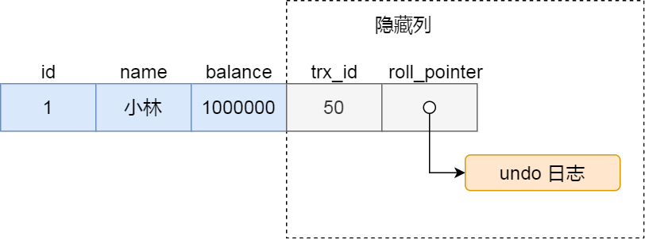
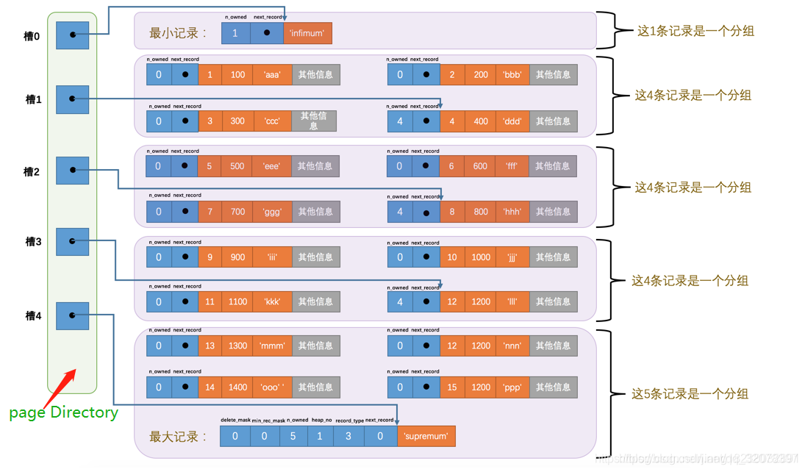
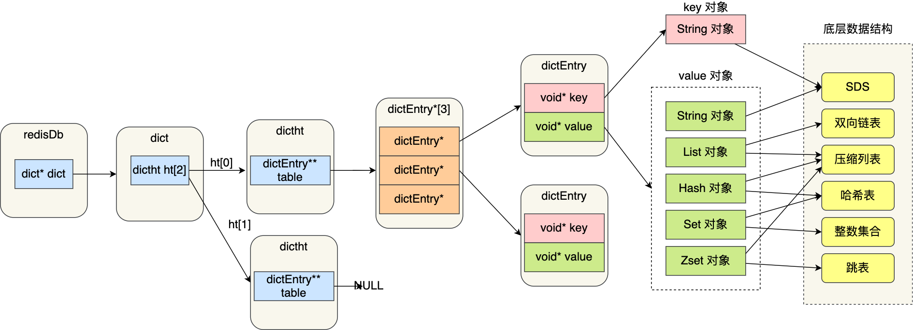
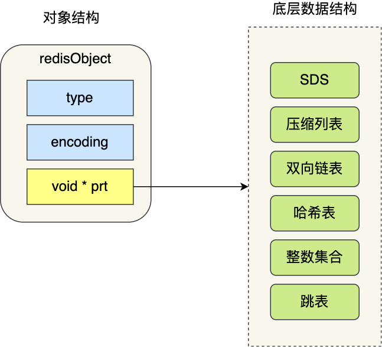

# 《数据库》

简单收录了 MySQL，Redis 相关，顺带提了一下 Memcache，MongoDB，Oracle。


# MySQL


## 数据类型

- MySQL 中的 int(M)，int(M) 里的 M 表示最大显示宽度，当加上 zerofill 才会表现出效果来。

- unsigned

- 编码
    - utf8_general_ci、utf8_unicode_ci 和 utf8_bin 的区别
    - [彻底解决 mysql 中文乱码 - CSDN 博客](https://blog.csdn.net/u012410733/article/details/61619656)


## SQL 语句

- select

  > select: 即最常用的查询，是不加任何锁的
  >
  > select ... lock in share mode: 会加共享锁 (Shared Locks)
  >
  > select ... for update: 会加排它锁

- 联接子句 union，join


## 范式

第一范式：1NF是对属性的原子性约束，要求属性具有原子性，不可再分解；

第二范式：2NF是对记录的惟一性约束，要求记录有惟一标识，即实体的惟一性；

第三范式：3NF是对字段冗余性的约束，即任何字段不能由其他字段派生出来，它要求字段没有冗余。

没有冗余的数据库设计可以做到。但是，没有冗余的数据库未必是最好的数据库，有时为了提高运行效率，就必须降低范式标准，适当保留冗余数据。具体做法是：在概念数据模型设计时遵守第三范式，降低范式标准的工作放到物理数据模型设计时考虑。降低范式就是增加字段，允许冗余。


## 锁

前言：

表锁，页面锁，行锁，共享锁，排它锁，意向锁，记录锁，间隙锁，临键锁......这些都是什么鬼？？？


### MySQL 有哪些锁

据加锁的范围，可以分为**全局锁、表级锁和行锁**三类。


#### 全局锁

```sql
flush tables with read lock
```

```sql
unlock tables
```

应用场景：**全库逻辑备份**

但在支持「可重复读隔离级别的事务」的存储引擎中，可避免使用全局锁备份：

InnoDB 存储引擎，在使用 mysqldump 时加上 `–single-transaction` 参数的时候，就会在备份数据库之前先开启事务，会先创建 Read View，然后整个事务执行期间都在用这个 Read View，而且由于 MVCC 的支持，备份期间业务依然可以对数据进行更新操作。


#### 表级锁

- 表锁；

  ```sql
  //表级别的共享锁，也就是读锁；
  lock tables t_student read;
  
  //表级别的独占锁，也就是写锁；
  lock tables t_stuent write;
  ```

  尽量避免在使用 InnoDB 引擎的表使用表锁，因为表锁的颗粒度太大，会影响并发性能，**InnoDB 牛逼的地方在于实现了颗粒度更细的行级锁**。

- 元数据锁（MDL）;

    - 对一张表进行 CRUD 操作时，加的是 **MDL 读锁**；
    - 对一张表做结构变更操作的时候，加的是 **MDL 写锁**；

- 意向锁；

    - 在使用 InnoDB 引擎的表里对某些记录加上「共享锁」之前，需要先在表级别加上一个「意向共享锁」；
    - 在使用 InnoDB 引擎的表里对某些纪录加上「独占锁」之前，需要先在表级别加上一个「意向独占锁」；

  **意向共享锁和意向独占锁是表级锁，不会和行级的共享锁和独占锁发生冲突，而且意向锁之间也不会发生冲突，只会和共享表锁（`lock tables ... read`）和独占表锁（`lock tables ... write`）发生冲突。**

  **意向锁的目的是为了快速判断表里是否有记录被加锁**。

- AUTO-INC 锁；

  在插入数据时，可以不指定主键的值，数据库会自动给主键赋值递增的值，这主要是通过 **AUTO-INC 锁**实现的。


#### 行级锁

InnoDB 引擎是支持行级锁的，而 MyISAM 引擎并不支持行级锁。

前面也提到，普通的 select 语句是不会对记录加锁的，因为它属于快照读。如果要在查询时对记录加行锁，可以使用下面这两个方式，这种查询会加锁的语句称为**锁定读**。

```sql
//对读取的记录加共享锁
select ... lock in share mode;

//对读取的记录加独占锁
select ... for update;
```

上面这两条语句必须在一个事务中，**因为当事务提交了，锁就会被释放**，所以在使用这两条语句的时候，要加上 begin、start transaction 或者 set autocommit = 0。

**共享锁（S锁）满足读读共享，读写互斥。独占锁（X锁）满足写写互斥、读写互斥。**

行级锁的类型主要有三类：

- Record Lock，记录锁，也就是仅仅把一条记录锁上；
- Gap Lock，间隙锁，锁定一个范围，但是不包含记录本身；
- Next-Key Lock：Record Lock + Gap Lock 的组合，锁定一个范围，并且锁定记录本身。


##### Record Lock

Record Lock 称为记录锁，锁住的是一条记录。而且记录锁是有 S 锁和 X 锁之分的：

- 当一个事务对一条记录加了 S 型记录锁后，其他事务也可以继续对该记录加 S 型记录锁（S 型与 S 锁兼容），但是不可以对该记录加 X 型记录锁（S 型与 X 锁不兼容）;
- 当一个事务对一条记录加了 X 型记录锁后，其他事务既不可以对该记录加 S 型记录锁（S 型与 X 锁不兼容），也不可以对该记录加 X 型记录锁（X 型与 X 锁不兼容）。


##### Gap Lock

Gap Lock 称为间隙锁，只存在于可重复读隔离级别，目的是为了解决可重复读隔离级别下幻读的现象。

间隙锁虽然存在 X 型间隙锁和 S 型间隙锁，但是并没有什么区别，**间隙锁之间是兼容的，即两个事务可以同时持有包含共同间隙范围的间隙锁，并不存在互斥关系，因为间隙锁的目的是防止插入幻影记录而提出的**。


##### Next-Key Lock

**next-key lock 是包含间隙锁+记录锁的，如果一个事务获取了 X 型的 next-key lock，那么另外一个事务在获取相同范围的 X 型的 next-key lock 时，是会被阻塞的**。


##### 插入意向锁

一个事务在插入一条记录的时候，需要判断插入位置是否已被其他事务加了间隙锁（next-key lock 也包含间隙锁）。

如果有的话，插入操作就会发生**阻塞**，直到拥有间隙锁的那个事务提交为止（释放间隙锁的时刻），在此期间会生成一个**插入意向锁**，表明有事务想在某个区间插入新记录，但是现在处于等待状态。

插入意向锁名字虽然有意向锁，但是它并**不是意向锁，它是一种特殊的间隙锁，属于行级别锁**。


### 加锁方式

MySQL 不同的存储引擎支持不同的锁机制

表锁：开销小，加锁快；不会出现死锁

行锁：开销大，加锁慢；会出现死锁

默认情况下，表锁和行锁都是自动获得的，不需要额外的命令。


####  什么 SQL 语句会加行级锁？

普通的 select 语句是不会对记录加锁的（除了串行化隔离级别），因为它属于快照读，是通过 MVCC（多版本并发控制）实现的。

如果要在查询时对记录加行级锁，可以使用下面这两个方式，这两种查询会加锁的语句称为**锁定读**。

```sql
//对读取的记录加共享锁(S型锁)
select ... lock in share mode;

//对读取的记录加独占锁(X型锁)
select ... for update;
```

上面这两条语句必须在一个事务中，**因为当事务提交了，锁就会被释放**，所以在使用这两条语句的时候，要加上 begin 或者 start transaction 开启事务的语句。

**除了上面这两条锁定读语句会加行级锁之外，update 和 delete 操作都会加行级锁，且锁的类型都是独占锁(X型锁)**。

```sql
//对操作的记录加独占锁(X型锁)
update table .... where id = 1;

//对操作的记录加独占锁(X型锁)
delete from table where id = 1;
```


#### MySQL 是怎么加行级锁的？

**加锁的对象是索引，加锁的基本单位是 next-key lock**，它是由记录锁和间隙锁组合而成的，**next-key lock 是前开后闭区间，而间隙锁是前开后开区间**。

但是，next-key lock 在一些场景下会退化成记录锁或间隙锁。

总结一句，**在能使用记录锁或者间隙锁就能避免幻读现象的场景下， next-key lock 就会退化成记录锁或间隙锁**。

​    

查询：

唯一索引等值查询

唯一索引范围查询

非唯一索引等值查询

非唯一索引范围查询

没有加索引的查询

​    

总结下， MySQL 行级锁的加锁规则。

唯一索引等值查询：

- 当查询的记录是「存在」的，在索引树上定位到这一条记录后，将该记录的索引中的 next-key lock 会**退化成「记录锁」**。
- 当查询的记录是「不存在」的，在索引树找到第一条大于该查询记录的记录后，将该记录的索引中的 next-key lock 会**退化成「间隙锁」**。

非唯一索引等值查询：

- 当查询的记录「存在」时，由于不是唯一索引，所以肯定存在索引值相同的记录，于是非唯一索引等值查询的过程是一个扫描的过程，直到扫描到第一个不符合条件的二级索引记录就停止扫描，然后**在扫描的过程中，对扫描到的二级索引记录加的是 next-key 锁，而对于第一个不符合条件的二级索引记录，该二级索引的 next-key 锁会退化成间隙锁。同时，在符合查询条件的记录的主键索引上加记录锁**。
- 当查询的记录「不存在」时，**扫描到第一条不符合条件的二级索引记录，该二级索引的 next-key 锁会退化成间隙锁。因为不存在满足查询条件的记录，所以不会对主键索引加锁**。

非唯一索引和主键索引的范围查询的加锁规则不同之处在于：

- 唯一索引在满足一些条件的时候，索引的 next-key lock 退化为间隙锁或者记录锁。
- 非唯一索引范围查询，索引的 next-key lock 不会退化为间隙锁和记录锁。

其实理解 MySQL 为什么要这样加锁，主要要以避免幻读角度去分析，这样就很容易理解这些加锁的规则了。

还有一件很重要的事情，在线上在执行 update、delete、select ... for update 等具有加锁性质的语句，一定要检查语句是否走了索引，**如果是全表扫描的话，会对每一个索引加 next-key 锁，相当于把整个表锁住了**，这是挺严重的问题。


### 锁释放

锁只有在执行 commit 或者 rollback 的时候才会释放，并且所有的锁都是在**同一时刻**被释放。


### 死锁

产生：两个或多个事务在同一资源上相互占用，并请求锁定对方占用的资源，从而导致恶性循环。


#### 死锁产生

普通的 select 语句是不会对记录加锁的，因为它是通过 MVCC 的机制实现的快照读，如果要在查询时对记录加行锁，可以使用下面这两个方式：

```sql
begin;
//对读取的记录加共享锁
select ... lock in share mode;
commit; //锁释放

begin;
//对读取的记录加排他锁
select ... for update;
commit; //锁释放
```

行锁的释放时机是在事务提交（commit）后，锁就会被释放，并不是一条语句执行完就释放行锁。


执行以下插入语句时，会在插入间隙上获取插入意向锁，**而插入意向锁与间隙锁是冲突的，所以当其它事务持有该间隙的间隙锁时，需要等待其它事务释放间隙锁之后，才能获取到插入意向锁。而间隙锁与间隙锁之间是兼容的，所以所以两个事务中 `select ... for update` 语句并不会相互影响**。


**间隙锁的意义只在于阻止区间被插入**，因此是可以共存的。

但是有一点要注意，**next-key lock 是包含间隙锁+记录锁的，如果一个事务获取了 X 型的 next-key lock，那么另外一个事务在获取相同范围的 X 型的 next-key lock 时，是会被阻塞的**。


#### 如何避免死锁

死锁的四个必要条件：**互斥、占有且等待、不可强占用、循环等待**。只要系统发生死锁，这些条件必然成立，但是只要破坏任意一个条件就死锁就不会成立。

在数据库层面，有两种策略通过「打破循环等待条件」来解除死锁状态：

- **设置事务等待锁的超时时间**。当一个事务的等待时间超过该值后，就对这个事务进行回滚，于是锁就释放了，另一个事务就可以继续执行了。在 InnoDB 中，参数 `innodb_lock_wait_timeout` 是用来设置超时时间的，默认值时 50 秒。

- **开启主动死锁检测**。主动死锁检测在发现死锁后，主动回滚死锁链条中的某一个事务，让其他事务得以继续执行。将参数 `innodb_deadlock_detect` 设置为 on，表示开启这个逻辑，默认就开启。

上面这个两种策略是「当有死锁发生时」的避免方式。


### 参考链接

[MySQL 锁总结](https://zhuanlan.zhihu.com/p/29150809/)

[MySQL 有哪些锁？ | 小林coding (xiaolincoding.com)](https://xiaolincoding.com/mysql/lock/mysql_lock.html)

[MySQL 是怎么加锁的？ | 小林coding (xiaolincoding.com)](https://xiaolincoding.com/mysql/lock/how_to_lock.html)


## 事务


### 事务特性，ACID 的含义

1. 原子性

   a. 事务是一个原子操作单元

   b. 要么都做，要么都不做，没有第三种情况

   c. 原子性仅能够保证单个事务的一致性!

2. 一致性

   a. 事务操作前和操作后都必须满足业务规则约束

   b. 比如资源数量一致：A 向 B 转账，转账前和转账后 AB 两个账户的总金额必须是一致的

   c. **一致性是最基本的属性**，其它的三个属性都为了保证一致性而存在的。为了保证**并发情况下**的一致性，引入了**隔离性**，即保证每一个事务能够看到的数据总是一致的，就好象其它并发事务并不存在一样。

3. 隔离性

   a. 多个并发事务同时对数据进行读写的能力

   b. 隔离性可以防止事务并发执行时由于交叉执行导致数据不一致的问题

4. 持久性

   a. 对数据的修改是永久的

   b. 即使出现系统故障也不会丢失


InnoDB 引擎通过什么技术来保证事务的这四个特性的呢？

- 持久性是通过 redo log （重做日志）来保证的；
- 原子性是通过 undo log（回滚日志） 来保证的；
- 隔离性是通过 MVCC（多版本并发控制） 或锁机制来保证的；
- 一致性则是通过持久性+原子性+隔离性来保证；


### 并发问题

1. 脏读

   一个事务正在对一条记录做修改，在这个事务提交之前，别的事务读取到了这个事务修改之后的数据，也就是说，一个事务读取到了其他事务还没有提交的数据，就叫做脏读。

2. 不可重复读（第一类不可重复读）

   一个事务读某条数据读两遍，读到的是不一样的数据，也就是说，一个事务在进行中读取到了其他事务对旧数据的修改结果。（比如说 我开一个事务 修改某条数据 先查后改 执行修改动作的时候发现这条数据已经被别的事务删掉了）

3. 幻读（第二类不可重复读）

   一个事务中，读取到了其他事务新增的数据，仿佛出现了幻象。（幻读与不可重复读类似，不可重复读是读到了其他事务 update/delete 的结果，幻读是读到了其他事务 insert 的结果）


### 隔离级别

1. 读未提交（read-uncommitted）

   在一个事务中，可以读取到其他事务未提交的数据变化，这种读取其他会话还没提交的事务，叫做脏读现象，在生产环境中切勿使用。

2. 读已提交（read-committed）

   Sql Server,Oracle 默认

   在一个事务中，可以读取到其他事务已经提交的数据变化，这种读取也就叫做不可重复读，因为两次同样的查询可能会得到不一样的结果。

3. 可重复读（repetable-read）

   MySQL 默认

   在一个事务中，直到事务结束前，都可以反复读取到事务刚开始时看到的数据，并一直不会发生变化，避免了脏读、不可重复读现象，但是**在 SQL 标准中**它还是无法解决幻读问题。

4. 可串行化（serializable）

   这是最高的隔离级别，它强制事务串行执行，避免了前面说的幻读现象，简单来说，它会在读取的每一行数据上都加锁，所以可能会导致大量的超时和锁争用问题。

​    

<table>
   <tr>
      <th> 隔离级别 </th>
      <th> 读数据一致性 </th>
      <th> 脏读 </th>
      <th> 不可重复读 </th>
      <th> 幻读 </th>
   </tr>
   <tr>
      <td> 读未提交 </td>
      <td> 最低级别，只保证不读取物理上损坏的数据 </td>
      <td> 有 </td>
      <td> 有 </td>
      <td> 有 </td>
   </tr>
   <tr>
      <td> 读已提交 </td>
      <td> 语句级 </td>
      <td> 无 </td>
      <td> 有 </td>
      <td> 有 </td>
   </tr>
   <tr>
      <td> 可重复读 </td>
      <td> 事务级 </td>
      <td> 无 </td>
      <td> 无 </td>
      <td> 可能有 </td>
   </tr>
   <tr>
      <td> 可串行化 </td>
      <td> 最高级别，事务级 </td>
      <td> 无 </td>
      <td> 无 </td>
      <td> 无 </td>
   </tr>
</table>


### 快照读

1. 快照读（普通读）：snapshot read，通过 MVCC 机制读取历史数据的方式

   > select * from table ....

2. 当前读：current read ，读取数据库最新版本数据的方式

   > insert、update、delete、select for update、select lock in share mode


### Read View 在 MVCC 里如何工作

两个知识：

- Read View 中四个字段作用；
- 聚簇索引记录中两个跟事务有关的隐藏列；

Read View：


Read View 有四个重要的字段：

- m_ids ：指的是在创建 Read View 时，当前数据库中「活跃事务」的**事务 id 列表**，注意是一个列表，**“活跃事务”指的就是，启动了但还没提交的事务**。
- min_trx_id ：指的是在创建 Read View 时，当前数据库中「活跃事务」中事务 **id 最小的事务**，也就是 m_ids 的最小值。
- max_trx_id ：这个并不是 m_ids 的最大值，而是**创建 Read View 时当前数据库中应该给下一个事务的 id 值**，也就是全局事务中最大的事务 id 值 + 1；
- creator_trx_id ：指的是**创建该 Read View 的事务的事务 id**。


了解聚簇索引记录中的两个隐藏列。

假设在账户余额表插入一条小林余额为 100 万的记录，然后我把这两个隐藏列也画出来，该记录的整个示意图如下：



对于使用 InnoDB 存储引擎的数据库表，它的聚簇索引记录中都包含下面两个隐藏列：

- trx_id，当一个事务对某条聚簇索引记录进行改动时，就会**把该事务的事务 id 记录在 trx_id 隐藏列里**；
- roll_pointer，每次对某条聚簇索引记录进行改动时，都会把旧版本的记录写入到 undo 日志中，然后**这个隐藏列是个指针，指向每一个旧版本记录**，于是就可以通过它找到修改前的记录。


在创建 Read View 后，我们可以将记录中的 trx_id 划分这三种情况：


一个事务去访问记录的时候，除了自己的更新记录总是可见之外，还有这几种情况：

- 如果记录的 trx_id 值小于 Read View 中的 `min_trx_id` 值，表示这个版本的记录是在创建 Read View **前**已经提交的事务生成的，所以该版本的记录对当前事务**可见**。
- 如果记录的 trx_id 值大于等于 Read View 中的 `max_trx_id` 值，表示这个版本的记录是在创建 Read View **后**才启动的事务生成的，所以该版本的记录对当前事务**不可见**。
- 如果记录的 trx_id 值在 Read View 的 `min_trx_id` 和 `max_trx_id` 之间，需要判断 trx_id 是否在 m_ids 列表中：
    - 如果记录的 trx_id **在** `m_ids` 列表中，表示生成该版本记录的活跃事务依然活跃着（还没提交事务），所以该版本的记录对当前事务**不可见**。
    - 如果记录的 trx_id **不在** `m_ids`列表中，表示生成该版本记录的活跃事务已经被提交，所以该版本的记录对当前事务**可见**。

**这种通过「版本链」来控制并发事务访问同一个记录时的行为就叫 MVCC（多版本并发控制）。**


**可重复读隔离级别是启动事务时生成一个 Read View，然后整个事务期间都在用这个 Read View**。

**读提交隔离级别是在每次读取数据时，都会生成一个新的 Read View**。


### 完全解决幻读了吗？

MySQL InnoDB 引擎的默认隔离级别虽然是「可重复读」，但是它很大程度上避免幻读现象（并不是完全解决了），解决的方案有两种：

- 针对**快照读**（普通 select 语句），是**通过 MVCC 方式解决了幻读**，因为可重复读隔离级别下，事务执行过程中看到的数据，一直跟这个事务启动时看到的数据是一致的，即使中途有其他事务插入了一条数据，是查询不出来这条数据的，所以就很好了避免幻读问题。
- 针对**当前读**（select ... for update 等语句），是**通过 next-key lock（记录锁+间隙锁）方式解决了幻读**，因为当执行 select ... for update 语句的时候，会加上 next-key lock，如果有其他事务在 next-key lock 锁范围内插入了一条记录，那么这个插入语句就会被阻塞，无法成功插入，所以就很好了避免幻读问题。

这两个解决方案是很大程度上解决了幻读现象，但是还是有个别的情况造成的幻读现象是无法解决的。

​    

第一个例子：对于快照读， MVCC 并不能完全避免幻读现象。因为当事务 A 更新了一条事务 B 插入的记录，那么事务 A 前后两次查询的记录条目就不一样了，所以就发生幻读。

第二个例子：对于当前读，如果事务开启后，并没有执行当前读，而是先快照读，然后这期间如果其他事务插入了一条记录，那么事务后续使用当前读进行查询的时候，就会发现两次查询的记录条目就不一样了，所以就发生幻读。

​    

所以，**MySQL 可重复读隔离级别并没有彻底解决幻读，只是很大程度上避免了幻读现象的发生。**

要避免这类特殊场景下发生幻读的现象的话，就是尽量在开启事务之后，马上执行 select ... for update 这类当前读的语句，因为它会对记录加 next-key lock，从而避免其他事务插入一条新记录。

​    

注意：

1. RR 级别下隐藏着一个操作，就是在事务 A 提交前，事务 B 已经进行过一次查询，否则，事务 B 会读取最新的数据。[原文](https://blog.csdn.net/thekenofdis/article/details/80736401)

2. 为什么很多文章都产生误传，说是可重复读可以解决幻读问题！原因出自官网的一句话 (地址是:`https://dev.mysql.com/doc/refman/5.7/en/innodb-locking.html#innodb-record-locks`)，原文内容如下

   > By default, InnoDB operates in REPEATABLE READ transaction isolation level. In this case, InnoDB uses next-key locks for searches and index scans, which prevents phantom rows (see Section 14.7.4, “Phantom Rows”).

   按照原本这句话的意思，应该是

   **InnoDB 默认用了 REPEATABLE READ。在这种情况下，使用 next-key locks 解决幻读问题！**

   结果估计，某个国内翻译人员翻着翻着变成了

   **InnoDB 默认用了 REPEATABLE READ。在这种情况下，可以解决幻读问题！**

   然后大家继续你抄我，我抄你，结果你懂的！

   显然，漏了"使用了 next-key locks！"这个条件后，意思完全改变，我们在该隔离级别下执行语句

   ```sql
   select *  from tx_tb where pId >= 1;
   ```

   是快照读，是不加任何锁的，根本不能解决幻读问题，除非你用

   ```sql
   select *  from tx_tb where pId >= 1 lock in share mode;
   ```

   这样，你就用上了 next-key locks，解决了幻读问题！

3. 其实幻读很多时候是我们完全可以接受的

​    

参考链接：

[深入理解 mysql 的事务隔离级别和底层实现原理](https://blog.csdn.net/suifeng629/article/details/99412343)

[Mysql 中 select 的正确姿势](https://www.cnblogs.com/rjzheng/p/9902911.html)，[新说 Mysql 事务隔离级别](https://www.cnblogs.com/rjzheng/p/9955395.html)，他的“[数据库系列](https://www.cnblogs.com/rjzheng/category/1281020.html)”都挺不错的

[MySQL 可重复读隔离级别，完全解决幻读了吗？ | 小林coding (xiaolincoding.com)](https://xiaolincoding.com/mysql/transaction/phantom.html)


### 事务传播

其实这个是`Spring`的概念，Spring 它对 JDBC 的隔离级别作出了补充和扩展，其提供了 7 种事务传播行为

1. **PROPAGATION_REQUIRED：默认事务类型，如果没有，就新建一个事务；如果有，就加入当前事务。适合绝大多数情况。**
2. PROPAGATION_REQUIRES_NEW：如果没有，就新建一个事务；如果有，就将当前事务挂起。
3. PROPAGATION_NESTED：如果没有，就新建一个事务；如果有，就在当前事务中嵌套其他事务。
4. PROPAGATION_SUPPORTS：如果没有，就以非事务方式执行；如果有，就使用当前事务。
5. PROPAGATION_NOT_SUPPORTED：如果没有，就以非事务方式执行；如果有，就将当前事务挂起。即无论如何不支持事务。
6. PROPAGATION_NEVER：如果没有，就以非事务方式执行；如果有，就抛出异常。
7. PROPAGATION_MANDATORY：如果没有，就抛出异常；如果有，就使用当前事务。


## 索引


### 索引分类

- 按「数据结构」分类：**B+tree索引、Hash索引、Full-text索引**。
- 按「物理存储」分类：**聚簇索引（主键索引）、二级索引（辅助索引）**。
- 按「字段特性」分类：**主键索引、唯一索引、普通索引、前缀索引**。
- 按「字段个数」分类：**单列索引、联合索引**。


#### B Tree


查找算法：首先在根节点进行二分查找，如果找到则返回对应节点的 data，否则在相应区间的指针指向的节点递归进行查找。


#### B+Tree


相比 B-Tree：

- 内节点不存储 data，只存储 key；
- 叶子节点不存储指针。

一般在数据库系统或文件系统中使用的 B+Tree 结构都在经典 B+Tree 基础上进行了优化，在叶子节点增加了顺序访问指针，做这个优化的目的是为了提高区间访问的性能。


**利用计算机预读特性**

操作系统一般将内存和磁盘分割成固态大小的块，每一块称为一页，内存与磁盘以页为单位交换数据。**数据库系统将索引的一个节点的大小设置为页的大小**，使得一次 I/O 就能完全载入一个节点，并且可以利用预读特性，相邻的节点也能够被预先载入。


#### B+Tree vs B Tree

B+Tree 只在叶子节点存储数据，而 B 树 的非叶子节点也要存储数据，所以 B+Tree 的单个节点的数据量更小，在相同的磁盘 I/O 次数下，就能查询更多的节点。

另外，B+Tree 叶子节点采用的是双链表连接，适合 MySQL 中常见的基于范围的顺序查找，而 B 树无法做到这一点。


#### 全文索引

全文索引有自己的语法格式，使用 match 和 against 关键字，比如

```sql
select * from fulltext_test 
    where match(content,tag) against('xxx xxx');
```


#### 前缀索引

前缀索引是指对字符类型字段的前几个字符建立的索引，而不是在整个字段上建立的索引，前缀索引可以建立在字段类型为 char、 varchar、binary、varbinary 的列上。


#### 聚簇索引

- 主键索引的 B+Tree 的叶子节点存放的是实际数据，所有完整的用户记录都存放在主键索引的 B+Tree 的叶子节点里；
- 二级索引的 B+Tree 的叶子节点存放的是主键值，而不是实际数据。

如果查询的数据能在二级索引里查询的到，那么就不需要回表，这个过程就是覆盖索引。如果查询的数据不在二级索引里，就会先检索二级索引，找到对应的叶子节点，获取到主键值后，然后再检索主键索引，就能查询到数据了，这个过程就是回表。


#### 联合索引

通过将多个字段组合成一个索引，该索引就被称为联合索引。

使用联合索引时，存在**最左匹配原则**，也就是按照最左优先的方式进行索引的匹配。在使用联合索引进行查询的时候，如果不遵循「最左匹配原则」，联合索引会失效，这样就无法利用到索引快速查询的特性了。

​    

最左前缀匹配原则

[mysql联合索引 - 沧海一滴 - 博客园](https://www.cnblogs.com/softidea/p/5977860.html)

> mysql 会一直向右匹配直到遇到范围查询 (>、<、between、like) 就停止匹配，比如 a = 1 and b = 2 and c > 3 and d = 4 如果建立 (a,b,c,d) 顺序的索引，d 是用不到索引的，如果建立 (a,b,d,c) 的索引则都可以用到，a,b,d 的顺序可以任意调整。    

​    

特殊情况：范围查询。

联合索引的最左匹配原则会一直向右匹配直到遇到「范围查询」就会停止匹配。**也就是范围查询的字段可以用到联合索引，但是在范围查询字段的后面的字段无法用到联合索引**。

> Q1: `select * from t_table where a > 1 and b = 2`，联合索引（a, b）哪一个字段用到了联合索引的 B+Tree？

**Q1 这条查询语句只有 a 字段用到了联合索引进行索引查询，而 b 字段并没有使用到联合索引**。

> Q2: `select * from t_table where a >= 1 and b = 2`，联合索引（a, b）哪一个字段用到了联合索引的 B+Tree？

**但是对于符合 a = 1 的二级索引记录的范围里，b 字段的值是「有序」的**

所以，**Q2 这条查询语句 a 和 b 字段都用到了联合索引进行索引查询**。


#### 索引下推

- MySQL 5.6 引入的**索引下推优化**（index condition pushdown)， **可以在联合索引遍历过程中，对联合索引中包含的字段先做判断，直接过滤掉不满足条件的记录，减少回表次数**。

当你的查询语句的执行计划里，出现了 Extra 为 `Using index condition`，那么说明使用了索引下推的优化。


### 什么时候需要 / 不需要创建索引？

#### 什么时候适用索引？

- 字段有唯一性限制的，比如商品编码；
- 经常用于 `WHERE` 查询条件的字段，这样能够提高整个表的查询速度，如果查询条件不是一个字段，可以建立联合索引。
- 经常用于 `GROUP BY` 和 `ORDER BY` 的字段，这样在查询的时候就不需要再去做一次排序了，因为我们都已经知道了建立索引之后在 B+Tree 中的记录都是排序好的。

#### 什么时候不需要创建索引？

- `WHERE` 条件，`GROUP BY`，`ORDER BY` 里用不到的字段，索引的价值是快速定位，如果起不到定位的字段通常是不需要创建索引的，因为索引是会占用物理空间的。
- 字段中存在大量重复数据，不需要创建索引，比如性别字段，只有男女，如果数据库表中，男女的记录分布均匀，那么无论搜索哪个值都可能得到一半的数据。在这些情况下，还不如不要索引，因为 MySQL 还有一个查询优化器，查询优化器发现某个值出现在表的数据行中的百分比很高的时候，它一般会忽略索引，进行全表扫描。
- 表数据太少的时候，不需要创建索引；
- 经常更新的字段不用创建索引，比如不要对电商项目的用户余额建立索引，因为索引字段频繁修改，由于要维护 B+Tree的有序性，那么就需要频繁的重建索引，这个过程是会影响数据库性能的。


### 优化索引

- 前缀索引优化；
- 覆盖索引优化；
- 主键索引最好是自增的；
- 防止索引失效；


### 索引失效

- 当我们使用左或者左右模糊匹配的时候，也就是 `like %xx` 或者 `like %xx%`这两种方式都会造成索引失效；
- 当我们在查询条件中对索引列使用函数，就会导致索引失效。
- 当我们在查询条件中对索引列进行表达式计算，也是无法走索引的。
- MySQL 在遇到字符串和数字比较的时候，会自动把字符串转为数字，然后再进行比较。如果字符串是索引列，而条件语句中的输入参数是数字的话，那么索引列会发生隐式类型转换，由于隐式类型转换是通过 CAST 函数实现的，等同于对索引列使用了函数，所以就会导致索引失效。
- 联合索引要能正确使用需要遵循最左匹配原则，也就是按照最左优先的方式进行索引的匹配，否则就会导致索引失效。
- 在 WHERE 子句中，如果在 OR 前的条件列是索引列，而在 OR 后的条件列不是索引列，那么索引会失效。


### MYSQL 如何挑选索引？

#### 执行计划

要想知道优化器选择了哪个索引，我们可以在查询语句最前面加个 `explain` 命令，这样就会输出这条 SQL 语句的执行计划。

对于执行计划，参数有：

- possible_keys 字段表示可能用到的索引；
- key 字段表示实际用的索引，如果这一项为 NULL，说明没有使用索引；
- key_len 表示索引的长度；
- rows 表示扫描的数据行数。
- type 表示数据扫描类型，我们需要重点看这个。

​    

type 字段就是描述了找到所需数据时使用的扫描方式是什么，常见扫描类型的**执行效率从低到高的顺序为**：

- All（全表扫描）；
- index（全索引扫描）；
- range（索引范围扫描）；
- ref（非唯一索引扫描）；
- eq_ref（唯一索引扫描）；
- const（结果只有一条的主键或唯一索引扫描）。

​    

除了关注 type，我们也要关注 extra 显示的结果。

这里说几个重要的参考指标：

- Using filesort ：当查询语句中包含 group by 操作，而且无法利用索引完成排序操作的时候， 这时不得不选择相应的排序算法进行，甚至可能会通过文件排序，效率是很低的，所以要避免这种问题的出现。
- Using temporary：使了用临时表保存中间结果，MySQL 在对查询结果排序时使用临时表，常见于排序 order by 和分组查询 group by。效率低，要避免这种问题的出现。
- Using index：所需数据只需在索引即可全部获得，不须要再到表中取数据，也就是使用了覆盖索引，避免了回表操作，效率不错。


### 索引使用场景

索引是在存储引擎层实现的，而不是在服务器层实现的，所以不同存储引擎具有不同的索引类型和实现。

1. 对于非常小的表、大部分情况下简单的全表扫描比建立索引更高效。
2. 对于中到大型的表，索引就非常有效。
3. 但是对于特大型的表，建立和维护索引的代价将会随之增长。这种情况下，需要用到一种技术可以直接区分出需要查询的一组数据，而不是一条记录一条记录地匹配，例如可以使用分区技术。

是否使用索引来检索数据是由 MySQL 通过判断不同执行计划的代价来决定的，可以通过 explain 检查 SQL 的执行计划，比如上面第一种情况，它就不会使用索引


### 索引缺点

- 创建索引和维护索引要耗费时间，这种时间随着数据量的增加而增加
- 索引需要占用物理空间，除了数据表占用数据空间之外，每一个索引还要占一定的物理空间，如果建立聚簇索引，那么需要的空间就会更大
- 当对表中的数据进行增加、删除和修改的时候，索引也需要维护，降低数据维护的速度


### 参考链接

[我以为我对Mysql索引很了解，直到我遇到了阿里的面试官_HollisChuang's Blog-CSDN博客](https://blog.csdn.net/hollis_chuang/article/details/95167242)

[数据库索引是如何工作的？ - 程序员和软件面试问题和答案 (programmerinterview.com)](https://www.programmerinterview.com/database-sql/what-is-an-index/)

[一通骚操作，我把SQL执行效率提高了10000000倍！ - 知乎](https://zhuanlan.zhihu.com/p/71763823)

[MySQL进阶之（二）索引的数据结构_mysql数据结构-CSDN博客](https://blog.csdn.net/qq_50994235/article/details/135306359)

[索引常见面试题 | 小林coding (xiaolincoding.com)](https://xiaolincoding.com/mysql/index/index_interview.html#什么是索引)


## 存储引擎 MyISAM

事务：不支持

锁：表级锁

应用场景：

MyISAM适合：(1)做很多count 的计算；(2)插入不频繁，查询非常频繁；(3)没有事务。

InnoDB适合：(1)可靠性要求比较高，或者要求事务；(2)表更新和查询都相当的频繁，并且行锁定的机会比较大的情况。


## 存储引擎 InnoDB

MySQL默认采用的是InnoDB。

了解他和 **MyISAM** 的主要区别。


### 页结构

页是 InnoDB 管理存储空间的基本单位，一个页的大小一般是 16kb。

数据页可以大致划分为 7 个部分：

| 字段名             | 中文名             | 大小    | 简单描述                           |
| ------------------ | ------------------ | ------- | ---------------------------------- |
| File Header        | 文件头部           | 38 字节 | 页的一些通用信息                   |
| Page Header        | 页面头部           | 56 字节 | 数据页专有的一些信息               |
| Infimum + Supremum | 最小记录和最大记录 | 26 字节 | 两个虚拟的行记录                   |
| User Records       | 用户记录           | 不确定  | 实际存储的行记录内容（大小不确定） |
| Free Space         | 空闲空间           | 不确定  | 页中尚未使用的空间                 |
| Page Directory     | 页面目录           | 不确定  | 页中的某些记录的相对位置           |
| File Trailer       | 文件尾部           | 8 字节  | 校验页是否完整                     |

当涉及到数据库读写的时候，规定数据库每次读写都是以16k为单位的，一次最少从磁盘中读取16KB的内容到内存中，一次最少把内存中的16KB内容刷新到磁盘中。

​    

**为什么默认为16kb？**

在操作系统的文件管理系统中进行一次io读写，默认读取的大小为4kb（一页）。又因为局部性原理，操作系统会将命中的页周围的三块页一同加载进innodb的缓存池中，因此innnodb缓存池中页的大小为16kb。

​    

**一颗B+tree存储多少行数据？**

B+tree树高为2，即存在一个根节点和若干个叶子节点，那这棵树存放总记录数为：**根节点指针树*单个叶子节点的记录行数。**

说明：

单个叶子节点（页）中的记录数=16K（一页16KB）/1K（假设一行1KB）=16。（这里假设一行记录的数据大小为1k）

计算非叶子节点能存放多少指针？假设主键ID为bigint类型，长度为8字节，而指针大小在InnoDB源码中设置为6字节，一共14字节，我们一个页中能存放多少这样的单元，其实就代表有多少指针，即 `16KB（16*1024=16384 byte）16384/14=1170（索引个数）`；可以算出一颗高度为2的B+tree，能存放 `1170*16=18720条` 数据记录。

根据同样的原理计算B+tree树高为3，可以存放 `1170（索引个数）*1170（索引个数）*16（每页行数）=21902400（2千万）条` 这样的记录

**总结：**InnoDB中B+tree树的高度为1-3层，就能满足千万级的数据存储，在查找数据时一次页的查找就代表一次IO，所以通过主键索引查询通常只需要1-3次IO操作即可查找数据

​    

**User Records (用户记录，即行记录)**

对于InnoDB存储引擎而言，常见的行格式类型有Compact、Redundant、Dynamic和Compressed。

​    

**Page Directory（页目录）**



**在一个数据页查找指定主键值的记录的过程分为两步：**

**1、通过二分法确定该记录所在的槽**

**2、通过该记录的next_record属性遍历该槽所在的组中的各个记录**

​    

**File Trailer**

页结构中的File Trailer的作用：

页中的数据在内存中被修改了，那么在修改后的某个时间需要把数据同步到磁盘中。但是在同步了一半的时候中断电了咋办，这不是莫名尴尬么？为了检测一个页是否完整（也就是在同步的时候有没有发生只同步一半的尴尬情况），设计InnoDB的大叔们在每个页的尾部都加了一个File Trailer部分，这个部分由8个字节组成，可以分成2个小部分：

- 前4个字节代表页的校验和

  这个部分是和File Header中的校验和相对应的。每当一个页面在内存中修改了，在同步之前就要把它的校验和算出来，因为File Header在页面的前边，所以校验和会被首先同步到磁盘，当完全写完时，校验和也会被写到页的尾部，如果完全同步成功，则页的首部和尾部的校验和应该是一致的。如果写了一半儿断电了，那么在File Header中的校验和就代表着已经修改过的页，而在File Trialer中的校验和代表着原先的页，二者不同则意味着同步中间出了错。

- 后4个字节代表页面被最后修改时对应的日志序列位置（LSN）

  这个部分也是为了校验页的完整性的，只不过我们目前还没说LSN是个什么意思，所以大家可以先不用管这个属性。

这个File Trailer与FILE Header类似，都是所有类型的页通用的。

​    

**参考：**

[MySQL架构（二）- InnoDB的存储结构](https://blog.csdn.net/qq_32078397/article/details/115560939)

[MySQL架构（三）- 磁盘存储数据页](https://blog.csdn.net/qq_32078397/article/details/115653204)


### 页的上层结构

在数据库中，还存在着区（Extent）、段（Segment）和表空间（Tablespace）的概念。

- 区（Extent）：是比页大一级的存储结构，在InnoDB存储引擎中，一个区会分配**64 个连续的页**。因为InnoDB中的页大小默认是16KB，所以一个区的大小是 64 * 16KB = 1MB
- 段（Segment）：由一个或多个 区 组成，区在文件系统是一个连续分配的空间（在InnoDB中是连续的 64 个页），不过**在段中不要求区与区之间是相邻的**。段是数据库中的分配单位，不同类型的数据库对象以不同的段形式存在。当我们创建数据表、索引的时候，就会相应创建对应的段，比如创建一张表时会创建一个表段，创建一个索引时会创建一个索引段
- 表空间（Tablespace）是一个逻辑容器，表空间存储的对象是段，在一个表空间中可以有一个或多个段，但是一个段只能属于一个表空间。数据库由一个或多个表空间组成，表空间从管理上可以划分为系统表空间、用户表空间、撤销表空间、临时表空间等。

​    

**为什么要有区**

- 1、B+树的每一层中的页都会形成一个双向链表，如果是以页为单位来分配存储空间的话，双向链表相邻的两个页之间的物流位置可能离得非常远。介绍B+树索引的适用场景的时候特别提到范围查询只需要定位到最左边的记录和最右边的记录，然后沿着双向链表一直扫描就可以了，而如果链表中相邻的两个页物理位置离得非常远，就是所谓的随机I/O。再一次强调，磁盘的速度和内存的速度差了好几个数量级，随机I/O是非常慢的，所以我们应该尽量让链表中相邻的页的物流位置也相邻，这样进行范围查询的时候才可以使用所谓的顺序 I/O。
- 2、引入区的概念，一个区就是在物理位置上连续的64个页。因为 InnoDB 中的页大小默认是 16KB，所以一个区的大小是 64 * 16KB = 1MB。在表中数据最大的时候，为某个索引分配空间的时候就不再按照页为分单位分配了，而是按照区位单位分配，甚至在表中的数据特别多的时候，可以一次性分配多个连续的区。虽然可能造成一点点空间的浪费（数据不足以填充满整个区），但是从性能角度看，可以消除很多的随机I/O，功大于过！！！

​    

**为什么要有段**

- 对于范围查询，其实是对B+树叶子节点中的记录进行顺序扫描，而如果不区分叶子节点和非叶子节点，统统把节点代表的页面放到申请到的区中的话，进行范围扫描的效果就大打折扣了。所以InnoDB对B+树的叶子节点 和 非叶子节点 进行了区别对待，也就是说叶子节点有自己独有的区，非叶子节点也有自己独有的额区。存放叶子节点的区的集合就算是一个 段（Segment），存放非叶子节点的区的集合也算是一个段。也就是说一个索引会生成2个段，一个叶子节点段，一个非叶子节点段。
- 除了索引的叶子节点段和非叶子节点段之外，InnoDB中还有为存储一些特殊的数据而定义的段，比如回滚段，所以，常见的段有数据段、索引段、回滚段。数据段即为B+树的叶子节点，索引段即为B+树的非叶子节点
- 在InnoDB存储引擎中，对段的管理都是由引擎自身所完成，DBA不能也没有必要对其进行控制。这从一定程度上简化了DBA对于段的管理。
- 段其实不对应表空间中某一个连续的物理区域，而是一个逻辑上的概念，由若干个零散的页面以及一些完整的区组成。

​    

**为什么要有碎片区**

为了考虑以完整的区为单位分配给某个段对于数据量较小的表太浪费存储空间的这种情况，InnoDB提出了一个碎片（Fragment）区的概念。在一个碎片区中，并不是所有的页都是为了存储同一个段的数据而存在的，而是碎片区中的页可以用于不同的目的，比如有些页用于段A，有些页用于段B，有些页甚至哪个段都不属于。碎片区直属于表空间，并不属于任何一个段。所以以后为某个段分配存储空间的策略如下：

- 在刚开始想表中插入数据的时候，段是从某个碎片区以单个页面为单位来分配存储空间的
- 当某个段已经占用了32个碎片区页面之后，就会申请以完整的区为单位来分配存储空间
- 现在段不能仅定义为是某些区的集合，更精确的应该是 某些零散的页面以及一些完整的区的集合

​    

**参考**

[一文读懂MySQL-InnoDB的数据库存储结构！ - 知乎 (zhihu.com)](https://zhuanlan.zhihu.com/p/580906303)


### 数据页加载方式

对于MySQL存放的数据，逻辑概念上我们称之为表，在磁盘物流层面而言是按数据页形式进行存放的，当起加载到MySQL中我们称之为缓存页。如果缓存池中没有该页数据，那么缓冲池有3种读取数据方式，每种方式的读取效率都是不同的。

内存读取、随机读取、顺序读取

​    

**顺序读取**

顺序读取其实是一种批量读取的方式，因为我们请求的数据在磁盘上往往都是相邻存储的，顺序读取可以帮助我们批量读取页面，这样的话，一次性加载到缓冲池中就不需要再对其他页单独进行磁盘I/O操作了。如果一个磁盘的吞吐量是 40MB/S，那么对于一个 16KB大小的页来说，一次可以顺序读取 2560（40MB/16KB）个页，相当于一个页的读取时间为 0.4ms。采用批量读取的方式，即使是从磁盘上进行读取，效率也比从内存中只单独读取一个页的效率要高。


### Buffer Pool

Innodb 存储引擎设计了一个缓冲池（Buffer Pool），来提高数据库的读写性能。

有了缓冲池后：

- 当读取数据时，如果数据存在于 Buffer Pool 中，客户端就会直接读取 Buffer Pool 中的数据，否则再去磁盘中读取。
- 当修改数据时，首先是修改 Buffer Pool 中数据所在的页，然后将其页设置为脏页，最后由后台线程将脏页写入到磁盘。

Buffer Pool 除了缓存「索引页」和「数据页」，还包括了 undo 页，插入缓存、自适应哈希索引、锁信息等等。

可以通过 `innodb_buffer_pool_size` 参数调整缓冲池的大小，默认是 128 M。

Innodb 通过三种链表来管理缓页：

- Free List （空闲页链表），管理空闲页；
- Flush List （脏页链表），管理脏页；
- LRU List，管理脏页+干净页，将最近且经常查询的数据缓存在其中，而不常查询的数据就淘汰出去。

​    

InnoDB 对 LRU 做了一些优化，我们熟悉的 LRU 算法通常是将最近查询的数据放到 LRU 链表的头部，而 InnoDB 做 2 点优化：

- 将 LRU 链表 分为**young 和 old 两个区域**，加入缓冲池的页，优先插入 old 区域；页被访问时，才进入 young 区域，目的是为了解决预读失效的问题。
- 当**「页被访问」且「 old 区域停留时间超过 `innodb_old_blocks_time` 阈值（默认为1秒）」**时，才会将页插入到 young 区域，否则还是插入到 old 区域，目的是为了解决批量数据访问，大量热数据淘汰的问题。

可以通过调整 `innodb_old_blocks_pct` 参数，设置 young 区域和 old 区域比例。


### 页分裂

当使用 InnoDB 存储引擎时，页分裂（Page Split）是指在插入或更新操作导致数据页（通常大小为 16KB）因为没有足够空间来容纳新的数据而必须被分裂成两个或多个数据页的过程。

页分裂过程的大致描述：

1. **数据插入**：当你插入一行新数据，InnoDB 会尝试将其放入适当的索引页中。如果该页已经满了（即已经达到了其容量），新的数据就无法放入。
2. **页分裂**：为了给新数据腾出空间，InnoDB 会将当前页的一些数据移动到新创建的页中，这个过程被称为页分裂。这通常会发生在以下情况：
   - 顺序插入：当数据按索引顺序插入，且最后一页已满，会创建一个新的页并在其上继续插入。
   - 非顺序插入：如果数据插入到中间的某个索引位置，导致中间的页溢出，那么会把一部分数据移动到新页中，以便为新数据腾出空间。
3. **效率降低**：页分裂会增加 I/O 操作，因为需要写入新的页，并可能需要更新父页和附近的页来维护 B+树的结构。此外，页分裂可能会导致数据碎片，即数据在物理存储上的布局不再连续，这会影响查询性能。
4. **空间利用率**：页分裂可能导致数据页的空间利用率下降，因为分裂操作通常会尽量平均地分配原页和新页的数据，但随着时间的推移，难以保持平衡，可能会导致空间的浪费。

​    

变长类型字段varchar值更新变长会页分裂吗？

如果页满了，会。

[mysql变长类型字段varchar值更新变长或变短底层文件存储原理-CSDN博客](https://blog.csdn.net/liuche1/article/details/121502439)


### 页合并

当你删了一行记录时，实际上记录并没有被物理删除，记录被标记（flaged）为删除并且它的空间变得允许被其他记录声明使用。

当页中删除的记录达到`MERGE_THRESHOLD`（默认页体积的50%），InnoDB会开始寻找最靠近的页（前或后）看看是否可以将两个页合并以优化空间使用。


### 行溢出（overflow）

MySQL 中磁盘和内存交互的基本单位是页，一个页的大小一般是 `16KB`，也就是 `16384字节`，而一个 varchar(n) 类型的列最多可以存储 `65532字节`，一些大对象如 TEXT、BLOB 可能存储更多的数据，这时一个页可能就存不了一条记录。这个时候就会**发生行溢出，多的数据就会存到另外的「溢出页」中**。

Compact 行格式针对行溢出的处理是这样的：当发生行溢出时，在记录的真实数据处只会保存该列的一部分数据，而把剩余的数据放在「溢出页」中，然后真实数据处用 20 字节存储指向溢出页的地址，从而可以找到剩余数据所在的页。

Compressed 和 Dynamic 这两种格式采用完全的行溢出方式，记录的真实数据处不会存储该列的一部分数据，只存储 20 个字节的指针来指向溢出页。而实际的数据都存储在溢出页中。

​    

如果一个数据行的大小超过了一个页的大小，MySQL 会将该行的部分数据存储在页内，而将剩余部分存储在一个或多个外部页（external page）中**（不同的行格式处理可能有细微不同）**。在存储引擎的实现中，MySQL可以通过使用链表或其他数据结构来链接主要页和外部页，以便有效地存储和检索溢出的数据。

使用行溢出机制存储的数据将会导致额外的磁盘 I/O 操作，因为获取一行数据可能需要读取主要页以及相关的外部页。这可能会对性能产生一定的影响。


## 日志

### binlog

**定义**

binlog 是 MySQL 的逻辑日志，也叫二进制日志、归档日志，由 MySQL Server 来记录。

用于记录用户对数据库操作的SQL语句（除了查询语句）信息，以二进制的形式保存在磁盘中。

​    

**记录方式**

binlog 通过追加的方式写入的，可通过配置参数 max_binlog_size 设置每个 binlog 文件的大小，当文件大小大于给定值后，日志会发生滚动，之后的日志记录到新的文件上。

​    

**格式**

binlog 日志有三种格式，分别为 STATMENT、ROW 和 MIXED。

|      | STATMENT                                                     | ROW                                                          |
| ---- | ------------------------------------------------------------ | ------------------------------------------------------------ |
| 说明 | 基于SQL语句的复制(statement-based replication, SBR)，每一条会修改数据的sql语句会记录到binlog中。**是bin log的默认格式。** | 基于行的复制(row-based replication, RBR)：不记录每一条SQL语句的上下文信息，仅保存哪条记录被修改。 |
| 优点 | 不需要记录每一条SQL语句与每行的数据变化，减少了bin log的日志量，节约了磁盘IO，提高性能。 | 会非常清楚的记录下每一行数据修改的细节，不会出现某些特定情况下的存储过程、或function、或trigger的调用和触发无法被正确复制的问题。 |
| 缺点 | 在某些情况下会导致master-slave中的**数据不一致**，如sleep()函数， last_insert_id()，以及user-defined functions(udf)等会出现问题。 | 会产生大量的日志，尤其是alter table的时候会让日志暴涨。      |

MIXED模式是基于 STATMENT 和 ROW 两种模式的混合复制(mixed-based replication, MBR)，一般的复制使用STATEMENT模式保存 binlog，对于 STATEMENT 模式无法复制的操作使用ROW模式保存 binlog，MySQL 会根据执行的 SQL 语句选择日志保存方式。


### redo log

**定义**

redo log 是 MySQL 的物理日志，也叫重做日志，记录存储引擎 InnoDB 的事务日志。

MySQL 每执行一条 SQL 更新语句，不是每次数据更改都立刻写到磁盘，而是先将记录写到 redo log 里面，并更新内存（这时内存与磁盘的数据不一致，将这种有差异的数据称为脏页），一段时间后，再一次性将多个操作记录写到到磁盘上，这样可以减少磁盘 io 成本，提高操作速度。**先写日志，再写磁盘**，这就是 MySQL 里经常说到的 WAL 技术，即 Write-Ahead Logging，又叫预写日志。MySQL 通过 WAL 技术保证事务的持久性。

​    

**记录方式**

InnoDB 的 redo log 大小是固定的，采用循环写的方式记录，当写到结尾时，会回到开头循环写日志。


​    

**Crash Safe（宕机重启）**

有了 redo log，当数据库发生宕机重启后，可通过 redo log 将未落盘的数据（check point 之后的数据）恢复，保证已经提交的事务记录不会丢失，这种能力称为 crash-safe。


#### 两阶段提交

有了 redo log，为什么还需要 binlog 呢？先来看看 binlog 和 redo log 的区别：

<table>
   <tr>
      <th></th>
      <th>redo log</th>
      <th>binlog</th>
   </tr>
   <tr>
      <td> 文件大小 </td>
      <td>redo log 的大小是固定的。</td>
      <td>binlog 可通过配置参数 max_binlog_size 设置每个 binlog 文件的大小。</td>
   </tr>
   <tr>
      <td> 实现方式 </td>
      <td>redo log 是 InnoDB 引擎层实现的，并不是所有引擎都有。</td>
      <td>binlog 是 Server 层实现的，所有引擎都可以使用 binlog 日志。</td>
   </tr>
   <tr>
      <td> 记录方式 </td>
      <td>redo log 采用循环写的方式记录，当写到结尾时，会回到开头循环写日志。日志上的记录修改落盘后，日志会被覆盖掉，无法用于数据回滚/数据恢复等操作。</td>
      <td>binlog 通过追加的方式记录，当文件大小大于给定值后，日志会发生滚动，之后的日志记录到新的文件上，不会覆盖以前的记录。</td>
   </tr>
</table>

由 binlog 和 redo log 的区别可知：binlog 日志只用于归档，只依靠 binlog 是没有 crash-safe 能力的。但只有 redo log 也不行，因为 redo log 是 InnoDB 特有的，且日志上的记录落盘后会被覆盖掉。因此需要 binlog 和 redo log 二者同时记录，才能保证当数据库发生宕机重启时，数据不会丢失。

​    

当执行一条 SQL 更新语句时，过程如下：


可以看到，在“两阶段提交”阶段，将 redo log 的写入分成了两步：prepare 和 commit。在 redo log 状态为 prepare 时记录 binlog 可以保证两个日志的记录一致。


### 如何执行数据恢复?

DB宕机后重启，InnoDB 会首先去查看数据页中的LSN的数值。这个值代表数据页被刷新回磁盘的 LSN 的大小。然后再去查看 redo log 的 LSN 的大小。

如果数据页中的 LSN 值大说明数据页领先于 redo log 刷新回磁盘，不需要进行恢复。反之需要从redo log中恢复数据。

> 注：LSN 是 日志序列号， 为 log sequence number 的缩写，主要用于发生 crash 时对数据进行 recovery。LSN是一个一直递增的整型数字，表示事务写入到日志的字节总量。
>
> LSN 不仅只存在于重做日志中，在每个数据页头部也会有对应的 LSN 号，该 LSN 记录当前页最后一次修改的 LSN 号，用于在 recovery 时对比重做日志 LSN 号决定是否对该页进行恢复数据。
>
> 前面说的check point也是由 LSN 号记录的，LSN 号串联起一个事务开始到恢复的过程。

​    

在宕机后，重启 MySQL 时，InnoDB 会自动恢复 redo log 中 `checkpoint_lsn` 后的，且**处于 commit 状态的事务**。如果 redo log 中事务的**状态为 prepare，则需要先查看 binlog 中该事务是否存在，是的话就恢复**，否则就通过 undo log 回滚。

​    

>如果将 innodb_flush_log_at_trx_commit 和 sync_binlog 参数设置成 1，前者表示每次事务的 redo log 都直接持久化到磁盘，后者表示每次事务的 binlog 都直接持久化到磁盘，可以双重保证 MySQL 异常重启之后的数据不会丢失。


### undo log

在MySQL中，事务的回滚主要依赖于undo log（回滚日志），而不是redo log（重做日志）。当一个事务需要被回滚时，MySQL会根据undo log中的信息，将事务的所有修改逐一回滚，从而将数据恢复到事务开始前的状态。

undo log只能用于回滚单个事务的修改，而不能用于恢复数据库宕机后的数据。如果数据库宕机，MySQL会依赖于redo log来恢复数据。

​    

**参考**

[MySQL 的日志系统](https://www.cnblogs.com/ivy-zheng/p/11094528.html)

[Crash Safe 和 Binlog 的关系](https://blog.csdn.net/shaochenshuo/article/details/73239949)

[MySQL事务日志--redo, undo详解_mysql redo undo-CSDN博客](https://blog.csdn.net/weixin_47786582/article/details/132701284)

[Redo Log 那些事儿！Redo Log 如何保证数据库不丢数据的？（MySQL两阶段提交详解） - 掘金 (juejin.cn)](https://juejin.cn/post/7130612183771119652#heading-10)


## 备份与恢复

- 冷备份，热备份
    - cp，mysqldump，lvm2 快照，xtrabackup
- [mysql 误删数据快速恢复](https://www.cnblogs.com/-mrl/p/9959365.html)


## 高级

- explain

  explain 显示了 mysql 如何使用索引来处理 select 语句以及连接表。可以帮助选择更好的索引和写出更优化的查询语句。

- 如何快速的删除一张大（TB 级别）表？

    1. 区分 drop，truncate，delete

       数据恢复方面：delete 可以恢复删除的数据，而 truncate 和 drop 不能恢复删除的数据。

       执行速度方面：drop > truncate > delete。

       删除数据方面：drop 是删除整张表，包含行数据和字段、索引等数据，而 truncate 和 drop 只删除了行数据。

       添加条件方面：delete 可以使用 where 表达式添加查询条件，而 truncate 和 drop 不能添加 where 查询条件。

       重置自增列方面：在 InnoDB 引擎中，truncate 可以重置自增列，而 delete 不能重置自增列。

    2. 利用 linux 中**硬链接**

- 慢日志

  可以设置一个时间，那么所有执行时间超过这个时间的 SQL 都会被记录下来。这样就可以通过慢日志快速的找到网站中 SQL 的瓶颈来进行优化。

- 冷热数据分离

  顾名思义就是分成两个库，一个是冷库一个是热库，几个月之前不常用的数据放到冷库中，最新的数据比较新的数据放到热库中。


## 分布式

- 主从复制，分库分表

- 分布式锁


## 参数优化


### innodb_buffer_pool_size

**InnoDB buffer pool 里包含什么？**

- **数据缓存**
  InnoDB数据页面
- **索引缓存**
  索引数据
- **缓冲数据**
  脏页（在内存中修改尚未刷新(写入)到磁盘的数据）
- **内部结构**
  如自适应哈希索引，行锁等。


**如何设置innodb_buffer_pool_size?**
innodb_buffer_pool_size默认大小为128M。最大值取决于CPU的架构。在32-bit平台上，最大值为2^32 -1,在64-bit平台上最大值为2^64-1。当缓冲池大小大于1G时，将innodb_buffer_pool_instances设置大于1的值可以提高服务器的可扩展性。

大的缓冲池可以减小多次磁盘I/O访问相同的表数据。**在专用数据库服务器上，可以将缓冲池大小设置为服务器物理内存的80%。**


# Redis


## 概述

Redis 是一种基于内存的数据库，对数据的读写操作都是在内存中完成，因此**读写速度非常快**，常用于**缓存，消息队列、分布式锁等场景**。

Redis 提供了多种数据类型来支持不同的业务场景，比如 String(字符串)、Hash(哈希)、 List (列表)、Set(集合)、Zset(有序集合)、Bitmaps（位图）、HyperLogLog（基数统计）、GEO（地理信息）、Stream（流），并且对数据类型的操作都是**原子性**的，因为执行命令由单线程负责的，不存在并发竞争的问题。

除此之外，Redis 还支持**事务 、持久化、Lua 脚本、多种集群方案（主从复制模式、哨兵模式、切片机群模式）、发布/订阅模式，内存淘汰机制、过期删除机制**等等。


## 数据类型

常见的五种数据类型：**String（字符串），Hash（哈希），List（列表），Set（集合）及 Zset(sorted set：有序集合)**。

这五种数据类型都由多种数据结构实现的，主要是出于时间和空间的考虑，当数据量小的时候使用更简单的数据结构，有利于节省内存，提高性能。

这五种数据类型与底层数据结构对应关系图如下，左边是 Redis 3.0版本的，也就是《Redis 设计与实现》这本书讲解的版本，现在看还是有点过时了，右边是现在 Github 最新的 Redis 代码的。


Redis 数据类型的底层数据结构随着版本的更新也有所不同，比如：

- 在 Redis 3.0 版本中 List 对象的底层数据结构由「双向链表」或「压缩表列表」实现，但是在 3.2 版本之后，List 数据类型底层数据结构是由 quicklist 实现的；
- 在最新的 Redis 代码中，压缩列表数据结构已经废弃了，交由 listpack 数据结构来实现了。

​    

Redis 五种数据类型的应用场景：

- String 类型的应用场景：缓存对象、常规计数、分布式锁、共享session信息等。
- List 类型的应用场景：消息队列（有两个问题：1. 生产者需要自行实现全局唯一 ID；2. 不能以消费组形式消费数据）等。
- Hash 类型：缓存对象、购物车等。
- Set 类型：聚合计算（并集、交集、差集）场景，比如点赞、共同关注、抽奖活动等。
- Zset 类型：排序场景，比如排行榜、电话和姓名排序等。

​    

Redis 后续版本又支持四种数据类型，它们的应用场景如下：

- BitMap（2.2 版新增）：二值状态统计的场景，比如签到、判断用户登陆状态、连续签到用户总数等；
- HyperLogLog（2.8 版新增）：海量数据基数统计的场景，比如百万级网页 UV 计数等；
- GEO（3.2 版新增）：存储地理位置信息的场景，比如滴滴叫车；
- Stream（5.0 版新增）：消息队列，相比于基于 List 类型实现的消息队列，有这两个特有的特性：自动生成全局唯一消息ID，支持以消费组形式消费数据。

​    

字符串    

字符串对象的内部编码（encoding）有 3 种 ：**int、raw和 embstr**。

​    

选择 hash 还是 string 存储数据？

一般对象用 String + Json 存储，对象中某些频繁变化的属性可以考虑抽出来用 Hash 类型存储。

 


## 数据结构

**共有 9 种数据结构：SDS、双向链表、压缩列表、哈希表、跳表、整数集合、quicklist、listpack。**


### 键值对数据库

Redis 的键值对中的 key 就是字符串对象，而 **value 可以是字符串对象，也可以是集合数据类型的对象**

Redis 是使用了一个「哈希表」保存所有键值对，哈希表的最大好处就是让我们可以用 O(1) 的时间复杂度来快速查找到键值对。哈希表其实就是一个数组，数组中的元素叫做哈希桶。

Redis 的哈希桶是怎么保存键值对数据的呢？

哈希桶存放的是指向键值对数据的指针（`dictEntry*`），这样通过指针就能找到键值对数据，然后因为键值对的值可以保存字符串对象和集合数据类型的对象，所以键值对的数据结构中并不是直接保存值本身，而是保存了 `void * key` 和 `void * value` 指针，分别指向了实际的键对象和值对象，这样一来，即使值是集合数据，也可以通过 `void * value` 指针找到。

里画了一张 Redis 保存键值对所涉及到的数据结构：



- redisDb 结构，表示 Redis 数据库的结构，结构体里存放了指向了 dict 结构的指针；
- dict 结构，结构体里存放了 2 个哈希表，正常情况下都是用「哈希表1」，「哈希表2」只有在 rehash 的时候才用，具体什么是 rehash，我在本文的哈希表数据结构会讲；
- ditctht 结构，表示哈希表的结构，结构里存放了哈希表数组，数组中的每个元素都是指向一个哈希表节点结构（dictEntry）的指针；
- dictEntry 结构，表示哈希表节点的结构，结构里存放了 **void * key 和 void * value 指针， *key 指向的是 String 对象，而 \*value 则可以指向 String 对象，也可以指向集合类型的对象，比如 List 对象、Hash 对象、Set 对象和 Zset 对象**。

​    

特别说明下，void * key 和 void * value 指针指向的是 **Redis 对象**，Redis 中的每个对象都由 redisObject 结构表示，如下图：



- type，标识该对象是什么类型的对象（String 对象、 List 对象、Hash 对象、Set 对象和 Zset 对象）；
- encoding，标识该对象使用了哪种底层的数据结构；
- **ptr，指向底层数据结构的指针**。


### SDS

简单动态字符串（simple dynamic string，SDS），解决 C 语言字符串的缺陷。

SDS 相比于 C 的原生字符串：

- **SDS 不仅可以保存文本数据，还可以保存二进制数据**。
- **SDS 获取字符串长度的时间复杂度是 O(1)**。SDS 结构里用 len 属性记录了字符串长度。
- **Redis 的 SDS API 是安全的，拼接字符串不会造成缓冲区溢出**。因为 SDS 在拼接字符串之前会检查 SDS 空间是否满足要求，如果空间不够会自动扩容，所以不会导致缓冲区溢出的问题。


### 压缩列表

**压缩列表紧凑型的内存布局能节省内存开销，但是如果保存的元素数量增加了，或是元素变大了，会导致内存重新分配，最糟糕的是会有「连锁更新」的问题**。

**压缩列表只会用于保存的节点数量不多的场景**，只要节点数量足够小，即使发生连锁更新，也是能接受的。


### 哈希表

字典 dictht


### 跳跃表

是有序集合的底层实现之一


## Redis 线程模型

### Redis 是单线程吗？

**Redis 单线程指的是「接收客户端请求->解析请求 ->进行数据读写等操作->发送数据给客户端」这个过程是由一个线程（主线程）来完成的**，这也是我们常说 Redis 是单线程的原因。

但是，**Redis 程序并不是单线程的**，Redis 在启动的时候，是会**启动后台线程**（BIO）的：

关闭文件、AOF 刷盘、释放内存这三个任务都有各自的任务队列：

- BIO_CLOSE_FILE，关闭文件任务队列：当队列有任务后，后台线程会调用 close(fd) ，将文件关闭；
- BIO_AOF_FSYNC，AOF刷盘任务队列：当 AOF 日志配置成 everysec 选项后，主线程会把 AOF 写日志操作封装成一个任务，也放到队列中。当发现队列有任务后，后台线程会调用 fsync(fd)，将 AOF 文件刷盘，
- BIO_LAZY_FREE，lazy free 任务队列：当队列有任务后，后台线程会 free(obj) 释放对象 / free(dict) 删除数据库所有对象 / free(skiplist) 释放跳表对象；


### Redis 单线程模式

单线程 + IO多路复用

**CPU 并不是制约 Redis 性能表现的瓶颈所在**，更多情况下是受到内存大小和网络I/O的限制，所以 Redis 核心网络模型使用单线程并没有什么问题


### 6.0 之后引入了多线程

**Redis 6.0 版本之后，也采用了多个 I/O 线程来处理网络请求**，**这是因为随着网络硬件的性能提升，Redis 的性能瓶颈有时会出现在网络 I/O 的处理上**。

所以为了提高网络 I/O 的并行度，Redis 6.0 对于网络 I/O 采用多线程来处理。**但是对于命令的执行，Redis 仍然使用单线程来处理，所以大家不要误解** Redis 有多线程同时执行命令。

​    

因此， Redis 6.0 版本之后，Redis 在启动的时候，默认情况下会**额外创建 6 个线程**（*这里的线程数不包括主线程*）：

- Redis-server ： Redis的主线程，主要负责执行命令；
- bio_close_file、bio_aof_fsync、bio_lazy_free：三个后台线程，分别异步处理关闭文件任务、AOF刷盘任务、释放内存任务；
- io_thd_1、io_thd_2、io_thd_3：三个 I/O 线程，io-threads 默认是 4 ，所以会启动 3（4-1）个 I/O 多线程，用来分担 Redis 网络 I/O 的压力。


## 过期删除

Redis 可以为每个键设置过期时间，当键过期时，会自动删除该键。

对于散列表这种容器，只能为整个键设置过期时间（整个散列表），而不能为键里面的单个元素设置过期时间。


### 如何判定 key 已过期了

每当我们对一个 key 设置了过期时间时，Redis 会把该 key 带上过期时间存储到一个**过期字典**（expires dict）中，也就是说「过期字典」保存了数据库中所有 key 的过期时间。

过期字典存储在 redisDb 结构中，如下：

```c
typedef struct redisDb {
    dict *dict;    /* 数据库键空间，存放着所有的键值对 */
    dict *expires; /* 键的过期时间 */
    ....
} redisDb;
```

过期字典数据结构结构如下：

- 过期字典的 key 是一个指针，指向某个键对象；
- 过期字典的 value 是一个 long long 类型的整数，这个整数保存了 key 的过期时间；


### Redis 过期删除策略

Redis 使用的过期删除策略是「**惰性删除+定期删除**」这两种策略配和使用。

定期删除策略的做法是，**每隔一段时间「随机」从数据库中取出一定数量的 key 进行检查，并删除其中的过期key。**

Redis 的定期删除的流程：

1. 从过期字典中随机抽取 20 个 key；
2. 检查这 20 个 key 是否过期，并删除已过期的 key；
3. 如果本轮检查的已过期 key 的数量，超过 5 个（20/4），也就是「已过期 key 的数量」占比「随机抽取 key 的数量」大于 25%，则继续重复步骤 1；如果已过期的 key 比例小于 25%，则停止继续删除过期 key，然后等待下一轮再检查。

可以看到，定期删除是一个循环的流程。那 Redis 为了保证定期删除不会出现循环过度，导致线程卡死现象，为此**增加了定期删除循环流程的时间上限，默认不会超过 25ms。**


## 内存淘汰

可以设置内存最大使用量，当内存使用量超出时，会施行数据淘汰策略。

LRU 算法和 **LFU 算法**，redis 对 LRU 的改进

[让我们一起聊聊如何改进 LRU 算法-改进leach算法 (51cto.com)](https://www.51cto.com/article/717466.html)


### Redis 是如何实现 LRU 算法的？

Redis 实现的是一种**近似 LRU 算法**，目的是为了更好的节约内存，它的**实现方式是在 Redis 的对象结构体中添加一个额外的字段，用于记录此数据的最后一次访问时间**。

当 Redis 进行内存淘汰时，会使用**随机采样的方式来淘汰数据**，它是随机取 5 个值（此值可配置），然后**淘汰最久没有使用的那个**。

Redis 实现的 LRU 算法的优点：

- 不用为所有的数据维护一个大链表，节省了空间占用；
- 不用在每次数据访问时都移动链表项，提升了缓存的性能；

但是 LRU 算法有一个问题，**无法解决缓存污染问题**，比如应用一次读取了大量的数据，而这些数据只会被读取这一次，那么这些数据会留存在 Redis 缓存中很长一段时间，造成缓存污染。

因此，在 Redis 4.0 之后引入了 LFU 算法来解决这个问题。


### Redis 是如何实现 LFU 算法的？

LFU 算法相比于 LRU 算法的实现，多记录了「数据的访问频次」的信息。Redis 对象的结构如下：

```c
typedef struct redisObject {
    ...
      
    // 24 bits，用于记录对象的访问信息
    unsigned lru:24;  
    ...
} robj;
```

Redis 对象头中的 lru 字段，在 LRU 算法下和 LFU 算法下使用方式并不相同。

**在 LRU 算法中**，Redis 对象头的 24 bits 的 lru 字段是用来记录 key 的访问时间戳，因此在 LRU 模式下，Redis可以根据对象头中的 lru 字段记录的值，来比较最后一次 key 的访问时间长，从而淘汰最久未被使用的 key。

**在 LFU 算法中**，Redis对象头的 24 bits 的 lru 字段被分成两段来存储，高 16bit 存储 ldt(Last Decrement Time)，用来记录 key 的访问时间戳；低 8bit 存储 logc(Logistic Counter)，用来记录 key 的访问频次。

Redis 在访问 key 时，对于 logc 是这样变化的：

1. 先按照上次访问距离当前的时长，来对 logc 进行衰减；
2. 然后，再按照一定概率增加 logc 的值


## 持久化

Redis 共有三种数据持久化的方式：

- **AOF 日志**：每执行一条写操作命令，就把该命令以追加的方式写入到一个文件里；
- **RDB 快照**：将某一时刻的内存数据，以二进制的方式写入磁盘；
- **混合持久化方式**：Redis 4.0 新增的方式，集成了 AOF 和 RBD 的优点；


### **AOF 日志**

Redis 在执行完一条写操作命令后，就会把该命令以追加的方式写入到一个AOF 文件（Append Only File）里。

Reids 是先执行写操作命令后，才将该命令记录到 AOF 日志里的。

​    

AOF 写回策略：

- **Always**，这个单词的意思是「总是」，所以它的意思是每次写操作命令执行完后，同步将 AOF 日志数据写回硬盘；
- **Everysec**，这个单词的意思是「每秒」，所以它的意思是每次写操作命令执行完后，先将命令写入到 AOF 文件的内核缓冲区，然后每隔一秒将缓冲区里的内容写回到硬盘；
- **No**，意味着不由 Redis 控制写回硬盘的时机，转交给操作系统控制写回的时机，也就是每次写操作命令执行完后，先将命令写入到 AOF 文件的内核缓冲区，再由操作系统决定何时将缓冲区内容写回硬盘。


### RDB 快照

将某个时间点的所有数据都存放到硬盘上。

Redis 提供了两个命令来生成 RDB 文件，分别是 save 和 bgsave，他们的区别就在于是否在「主线程」里执行：

- 执行了 save 命令，就会在主线程生成 RDB 文件，由于和执行操作命令在同一个线程，所以如果写入 RDB 文件的时间太长，**会阻塞主线程**；
- 执行了 bgsave 命令，会创建一个子进程来生成 RDB 文件，这样可以**避免主线程的阻塞**；

​    

RDB 在执行快照的时候，数据能修改吗？

可以的，执行 bgsave 过程中，Redis 依然**可以继续处理操作命令**的，也就是数据是能被修改的，关键的技术就在于**写时复制技术（Copy-On-Write, COW）。**

执行 bgsave 命令的时候，会通过 fork() 创建子进程，此时子进程和父进程是共享同一片内存数据的，因为创建子进程的时候，会复制父进程的页表，但是页表指向的物理内存还是一个，此时如果主线程执行读操作，则主线程和 bgsave 子进程互相不影响。

如果主线程执行写操作，则被修改的数据会复制一份副本，然后 bgsave 子进程会把该副本数据写入 RDB 文件，在这个过程中，主线程仍然可以直接修改原来的数据。


## Redis 集群


### 高可用

要想设计一个高可用的 Redis 服务，一定要从 Redis 的多服务节点来考虑，比如 Redis 的主从复制、哨兵模式、切片集群。

​    

**主从复制：**

主服务器可以进行读写操作，当发生写操作时自动将写操作同步给从服务器，而从服务器一般是只读，并接受主服务器同步过来写操作命令，然后执行这条命令。

​    

**哨兵模式 Sentinel：**

在使用 Redis 主从服务的时候，会有一个问题，就是当 Redis 的主从服务器出现故障宕机时，需要手动进行恢复。

为了解决这个问题，Redis 增加了哨兵模式（**Redis Sentinel**），因为哨兵模式做到了可以监控主从服务器，并且提供**主从节点故障转移的功能。**

​    

**切片集群模式 Cluster：**

它将数据分布在不同的服务器上，以此来降低系统对单主节点的依赖，从而提高 Redis 服务的读写性能。

Redis Cluster 方案采用哈希槽（Hash Slot），来处理数据和节点之间的映射关系。在 Redis Cluster 方案中，**一个切片集群共有 16384 个哈希槽**，这些哈希槽类似于数据分区，每个键值对都会根据它的 key，被映射到一个哈希槽中，具体执行过程分为两大步：

- 根据键值对的 key，按照 CRC16 算法 计算一个 16 bit 的值。
- 再用 16bit 值对 16384 取模，得到 0~16383 范围内的模数，每个模数代表一个相应编号的哈希槽。

接下来的问题就是，这些哈希槽怎么被映射到具体的 Redis 节点上的呢？有两种方案：

- **平均分配：** 在使用 cluster create 命令创建 Redis 集群时，Redis 会自动把所有哈希槽平均分布到集群节点上。比如集群中有 9 个节点，则每个节点上槽的个数为 16384/9 个。
- **手动分配：** 可以使用 cluster meet 命令手动建立节点间的连接，组成集群，再使用 cluster addslots 命令，指定每个节点上的哈希槽个数。

​    

参考：

[Redis 数据倾斜问题 集群模式 redis集群 数据一致性](https://blog.51cto.com/u_16099336/6598110)

[Redis主从集群切换数据丢失问题如何应对？](https://blog.51cto.com/u_16147814/6399335)


### 两种redis集群解决方案：codis和cluster

#### Codis

Codis是Redis集群方案之一，Codis使用Go语言开发，是一个代理中间件，和Redis一样使用Redis协议对外提供服务。当客户端向Codis发送指令时，Codis负责将指令转发到后面的Redis实例来执行，并将返回结果转回客户端。

​    

**Codis的优缺点**

缺点：

- Codis所有的key分散在不同的Redis实例中，所以不再支持事务，事务只能在单个Redis实例中完成。
- 为了支持扩容，单个key的value不宜过大，因为集群迁移的最小单位是key
- 因为增加了Proxy中转层，所以在网络开销上要比单个Redis大
- 配置中心使用zookeeper实现，意味着在部署上增加了zookeeper运维的代价

优点：

- 将分布式的问题交给了第三方负责，自己**省去了复杂的分布式一致性**代码的编写与维护工作。


#### Redis Cluster

Redis Cluster是Redis作者自己提供的集群化方案。它是**去中心化**的，每个节点负责整个集群的一部分数据，节点之间互相连接组成一个对等的集群，它们之间使用一种特殊的二进制协议交互信息。

​    

**可能下线与确定下线**

Redis Cluster是去中心化的，一个节点认为某个节点失联了并不代表所有节点都认为它失联了。只有当**大多数节点**都认定某个节点失联了，集群才认为该节点需要进行主从切换来容错。

Redis集群采用**Gossip协议**来广播自己的状态以及改变对整个集群的认知。

一个节点发现某个节点失联了（这时为可能下线），将这条信息向整个集群广播。如果收到了某个节点失联的节点数量达到了集群的大多数，就可以标记为此节点确定下线，然后对改失联节点进行主从切换。

​    

#### 对比

|              | Codis                                                       | Redis Cluster                   |
| ------------ | ----------------------------------------------------------- | ------------------------------- |
| 数据路由信息 | 中心化持久保存在zookeeper，proxy中缓存                      | 每个实例中保存一份              |
| 集群扩容     | 支持新增Codis server和Codis proxy                           | 新增Redis实例                   |
| 数据迁移     | 同步迁移、异步迁移                                          | 同步迁移                        |
| 客户端兼容性 | 兼容单实例客户端                                            | 需要开发支持cluster功能的客户端 |
| 可靠性       | codis server：主从集群机制；codis proxy：无状态，故障后重启 | 主从集群机制                    |


### 脑裂

在 Redis 主从架构中，由于网络问题，集群节点之间失去联系。主从数据会开始不同步；哨兵重新平衡选举，产生两个主服务。等网络恢复，旧主节点会降级为从节点，再与新主节点进行同步复制的时候，由于会从节点会清空自己的缓冲区，所以导致之前客户端写入的数据丢失了。

​    

解决方案

在 Redis 的配置文件中有两个参数我们可以设置：

- min-slaves-to-write x，主节点必须要有至少 x 个从节点连接，如果小于这个数，主节点会禁止写数据。
- min-slaves-max-lag x，主从数据复制和同步的延迟不能超过 x 秒，如果超过，主节点会禁止写数据。


## 缓存设计


### 数据一致性

- 产生原因

    1. 并发的场景下，导致读取老的 DB 数据，更新到缓存中。
    2. 缓存和 DB 的操作，不在一个事务中，可能只有一个操作成功，而另一个操作失败，导致不一致。


- 更新缓存的设计模式

    1. Cache Aside Pattern（旁路缓存，**常用**）

        - **失效**：应用程序先从cache取数据，没有得到，则从数据库中取数据，成功后，放到缓存中。

        - **命中**：应用程序从cache中取数据，取到后返回。

        - **更新**：先把数据存到数据库中，成功后，再让缓存失效。

    2. Read/Write Through Pattern

       把更新数据库的操作由缓存自己代理了，但**Cache自己更新数据库是一个同步操作**

    3. Write Behind Caching Pattern（游戏开发会常用）

       Write Behind 又叫 Write Back。Write Behind 就是 Linux 文件系统的 Page Cache 算法。

       Write Back套路，一句说就是，在更新数据的时候，只更新缓存，不更新数据库，而我们的缓存会异步地批量更新数据库。

       > 这个设计的好处就是让数据的 I/O 操作飞快无比（因为直接操作内存嘛），因为异步，write backg 还可以合并对同一个数据的多次操作，所以性能的提高是相当可观的。


- 数据库与缓存双写问题

    - 思考

      按照Cache Aside Pattern的更新，这种方式真的没问题吗？

    - 最终一致性的解决方案

      从理论上来说，给缓存设置过期时间，是保证最终一致性的解决方案。

      这种方案下，我们可以对存入缓存的数据设置过期时间，所有的写操作以数据库为准，对缓存操作只是尽最大努力即可。也就是说如果数据库写成功，缓存更新失败，那么只要到达过期时间，则后面的读请求自然会从数据库中读取新值然后回填缓存。

      不依赖于给缓存设置过期时间的方案：

        1. 先更新数据库，再更新缓存

           会有冷数据（多写少读）

        2. 先删除缓存，再更新数据库

           A线程删缓存但未更新DB，B线程读并写入缓存导致脏数据。解决方案是使用延迟双删（第二次**删除失败**怎么办?）

        3. 先更新数据库，再删除缓存

           缓存刚好失效，A线程读并写入缓存，过程中穿插了B线程的更新DB删除缓存。概率极小，该方案可满足大部分的应用场景。

      （为什么没有先更新缓存，再更新数据库这种策略？若先更新缓存，缓存更新成功，但是更新数据库时发生异常导致回滚，那么缓存中的数据无法回滚，导致数据不一致。看产生原因的第二点）

      删除缓存失败：

      解决方案是消息队列或者其他 binlog 同步，引入消息队列会带来更多的问题，并不推荐直接使用。

      参考：

        - [缓存的双写一致性解决方案 解决redis与mysql数据一致性 看不懂的你来打我~_kingtok的博客](https://blog.csdn.net/kingtok/article/details/106689121)


- 一致性恢复方案

  TODO 如果出现了问题，怎么解决？

- 主从DB与cache一致性

  TODO

- 回顾一下分布式事务一致性，别混淆


### 缓存雪崩、击穿、穿透

[《吊打面试官》系列-缓存雪崩、击穿、穿透](https://blog.csdn.net/qq_35190492/article/details/102889333)


#### 缓存雪崩

**大量缓存数据在同一时间过期（失效）时，如果此时有大量的用户请求，都无法在 Redis 中处理，于是全部请求都直接访问数据库，从而导致数据库的压力骤增，严重的会造成数据库宕机，从而形成一系列连锁反应，造成整个系统崩溃**

可以采用两种方案解决。

- **将缓存失效时间随机打散：** 我们可以在原有的失效时间基础上增加一个随机值（比如 1 到 10 分钟）这样每个缓存的过期时间都不重复了，也就降低了缓存集体失效的概率。
- **设置缓存不过期：** 我们可以通过后台服务来更新缓存数据，从而避免因为缓存失效造成的缓存雪崩，也可以在一定程度上避免缓存并发问题。


#### 缓存击穿

如果缓存中的**某个热点数据过期**了，此时大量的请求访问了该热点数据，就无法从缓存中读取，直接访问数据库，数据库很容易就被高并发的请求冲垮

两种方案：

- 互斥锁方案（Redis 中使用 setNX 方法设置一个状态位，表示这是一种锁定状态），保证同一时间只有一个业务线程请求缓存，未能获取互斥锁的请求，要么等待锁释放后重新读取缓存，要么就返回空值或者默认值。
- 不给热点数据设置过期时间，由后台异步更新缓存，或者在热点数据准备要过期前，提前通知后台线程更新缓存以及重新设置过期时间；


#### 缓存穿透

当用户访问的数据，**既不在缓存中，也不在数据库中**，导致请求在访问缓存时，发现缓存缺失，再去访问数据库时，发现数据库中也没有要访问的数据，没办法构建缓存数据，来服务后续的请求。那么当有大量这样的请求到来时，数据库的压力骤增

常见的方案有三种。

- **非法请求的限制**：当有大量恶意请求访问不存在的数据的时候，也会发生缓存穿透，因此在 API 入口处我们要判断求请求参数是否合理，请求参数是否含有非法值、请求字段是否存在，如果判断出是恶意请求就直接返回错误，避免进一步访问缓存和数据库。
- **设置空值或者默认值**：当我们线上业务发现缓存穿透的现象时，可以针对查询的数据，在缓存中设置一个空值或者默认值，这样后续请求就可以从缓存中读取到空值或者默认值，返回给应用，而不会继续查询数据库。
- **使用布隆过滤器快速判断数据是否存在，避免通过查询数据库来判断数据是否存在**：我们可以在写入数据库数据时，使用布隆过滤器做个标记，然后在用户请求到来时，业务线程确认缓存失效后，可以通过查询布隆过滤器快速判断数据是否存在，如果不存在，就不用通过查询数据库来判断数据是否存在，即使发生了缓存穿透，大量请求只会查询 Redis 和布隆过滤器，而不会查询数据库，保证了数据库能正常运行，Redis 自身也是支持布隆过滤器的。


## 应用场景

分布式锁、延时队列、位图、HyperLogLog、布隆过滤器、简单限流（zset）、漏斗限流、GeoHash（地理位置）

### 限流

[Redis应用-限流 - 掘金 (juejin.cn)](https://juejin.cn/post/6844903880858451976)


### 分布式锁

1. 单实例中实现分布式锁：

   setnx（注意删除时最好使用 Lua 脚本删除，逻辑是先获取 key，如果存在并且值是自己设置的就删除此 key，否则就跳过）

   set key value px milliseconds nx（使用 set 代替 setnx，相当于 setnx + expire 实现了原子性，不必担心 setnx 成功，expire 失败的问题）

2. 多节点 redis 实现的分布式锁

   RedLock

   可以看看 redission 的实现

参考：

  * [redis分布式锁深度剖析(超时情况)](https://blog.csdn.net/u010325193/article/details/87887030)
  * [Redlock：Redis分布式锁最牛逼的实现](https://mp.weixin.qq.com/s/JLEzNqQsx-Lec03eAsXFOQ)
  * [Redlock（redis分布式锁）原理分析 - RGC](https://www.cnblogs.com/rgcLOVEyaya/p/RGC_LOVE_YAYA_1003days.html)


## 额外的知识点

### 管道

管道技术（Pipeline）是客户端提供的一种批处理技术，用于一次处理多个 Redis 命令，从而提高整个交互的性能。

要注意的是，管道技术本质上是客户端提供的功能，而非 Redis 服务器端的功能。


### 事务

注意 redis 事务**不保证原子性**，**不支持回滚**。他总结来说：**就是一次性、顺序性、排他性的执行一个队列中的一系列命令**。其他客户端提交的命令请求不会插入到事务执行命令序列中。

思考一下，为什么这样设计？

作者不支持事务回滚的原因有以下两个：

- 他认为 Redis 事务的执行时，错误通常都是编程错误造成的，这种错误通常只会出现在开发环境中，而很少会在实际的生产环境中出现，所以他认为没有必要为 Redis 开发事务回滚功能；
- 不支持事务回滚是因为这种复杂的功能和 Redis 追求的简单高效的设计主旨不符合。


### 其他

1. 客户端与服务器的通信协议

2. Info 指令

3. 源码

    - [带有详细注释的 Redis 3.0 代码](https://github.com/huangz1990/redis-3.0-annotated)
    - jemalloc，Redis 默认使用 jemalloc(facebook) 库来管理内存

4. Java 的 Redis 客户端：Jedis，Redisson

    1. Redisson 不仅封装了 redis ，还封装了对更多数据结构的支持，以及锁等功能，相比于 Jedis 更加大。

       Redisson 的加锁/释放锁都是用 Lua 脚本，相比于 setnx 就能实现，为何多此一举？仔细看 Lua 脚本就会发现考虑得非常全面，其中包括锁的**重入性**。

    2. 但 Jedis 相比于 Redisson 更原生一些，更灵活。


## Redis模块

- ReJSON模块

  ReJSON 是一个Redis Module，它实现了`ECMA-404 The JSON Data Interchange Standard`作为本地数据类型，它允许从Redis Keys（documents）中存储，更新和获取 JSON 值

  主要特性：

    1. 完全支持JSON标准
    2. 对于在文档内选择元素类似 JSONPath 语法
    3. 文档作为二进制数据被存储在一个树形结构中，允许快速访问子元素
    4. 对所有 JSON 数据类型按照原子操作进行分类

  ReJSON 是由 Redis Labs 开发的，源码下载地址是 https://github.com/RedisLabsModules/ReJSON


## 书单

- 《redis 设计与实现 (第二版)》
- 《Redis 深度历险:核心原理与应用实践》


# Memcache

 Redis 与 Memcached **共同点**：

1. 都是基于内存的数据库，一般都用来当做缓存使用。
2. 都有过期策略。
3. 两者的性能都非常高。

​    

Redis 与 Memcached **区别**：

- Redis 支持的数据类型更丰富（String、Hash、List、Set、ZSet），而 Memcached 只支持最简单的 key-value 数据类型；
- Redis 支持数据的持久化，可以将内存中的数据保持在磁盘中，重启的时候可以再次加载进行使用，而 Memcached 没有持久化功能，数据全部存在内存之中，Memcached 重启或者挂掉后，数据就没了；
- Redis 原生支持集群模式，Memcached 没有原生的集群模式，需要依靠客户端来实现往集群中分片写入数据；
- Redis 支持发布订阅模型、Lua 脚本、事务等功能，而 Memcached 不支持；


# MongoDB

为什么Mongodb索引用B树，而Mysql用B+树? 

于关系型数据库和非关系型数据的设计方式上的不同。导致在关系型数据中，遍历操作比较常见，因此采用B+树作为索引，比较合适。而在非关系型数据库中，单一查询比较常见，因此采用B树作为索引，比较合适。

[为什么 Mongodb 索引用 B 树，而 Mysql 用 B+树?](https://www.cnblogs.com/rjzheng/p/12316685.html)


# Oracle

- 冷备份

    1. 正常关闭数据库
    2. 备份所有重要的文件到备份目录（数据文件、控制文件、重做日志文件等）
    3. 完成备份后启动数据库

- 热备份

- 数据恢复

  [几种oracle数据库恢复的练习示例](https://www.cnblogs.com/rootq/articles/1065048.html)