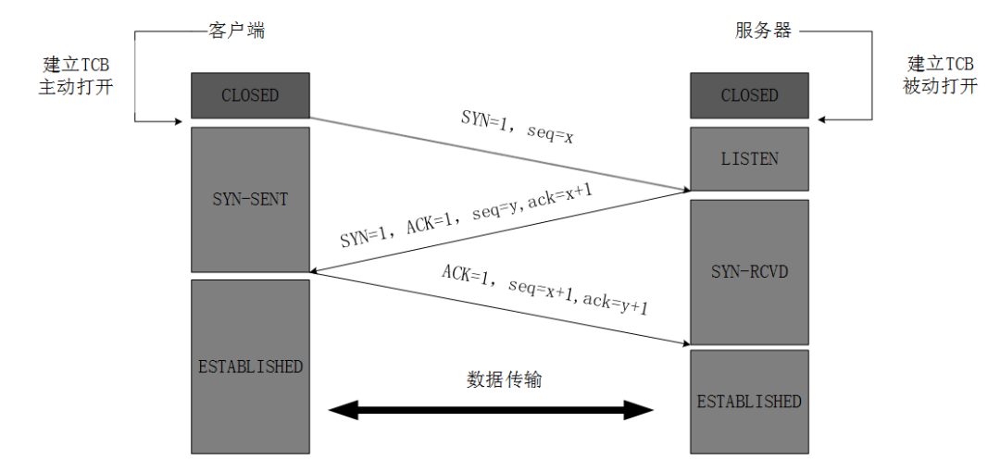
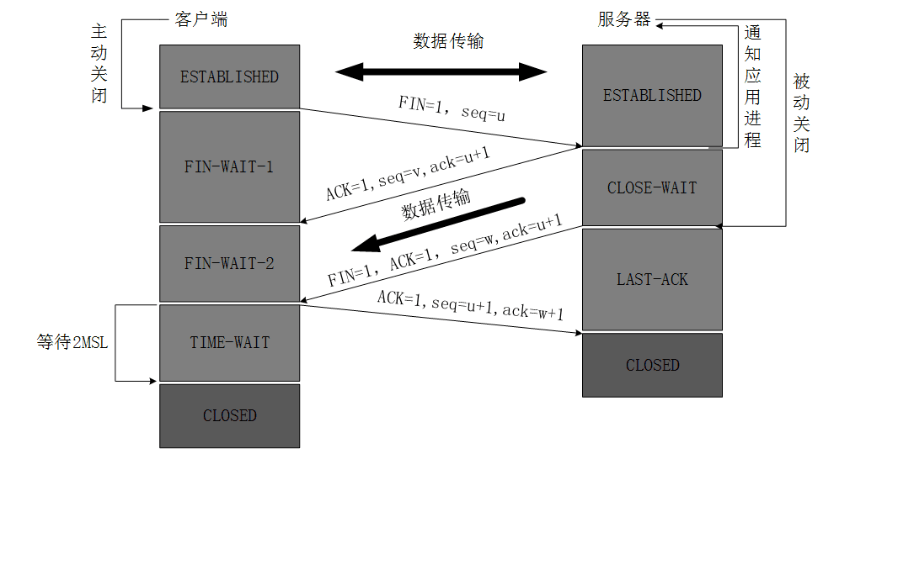
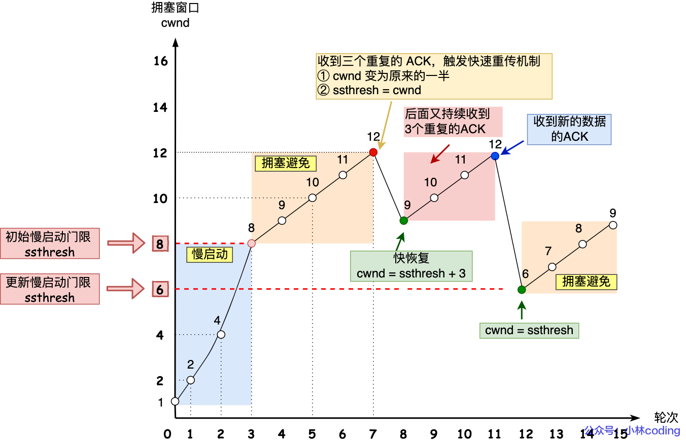

# 《网络》

## TCP/IP 四层（参考）模型

[OSI 七层模型与 TCP/IP 四层（参考）模型](https://www.jianshu.com/p/c793a279f698)

## 底层网络协议

ARP，ICMP（网际控制信息协议），路由选择，DHCP，NAT

### IPv6

[网络编程懒人入门(十一)：一文读懂什么是IPv6-网络编程](http://www.52im.net/thread-2979-1-1.html)

## TCP/IP

### TCP三次握手和四次挥手

三次握手：

四次挥手：

**为什么TCP握手，客户端最后还要发送一次确认呢？**

> 这主要是为了防止已失效的连接请求报文段突然又传到了 TCP 服务器，避免产生错误。
>
> 两次握手的机制将会让客户端和服务器再次建立连接，这将导致不必要的错误和资源的浪费。
>
> 如果采用的是三次握手，就算是那一次失效的报文传送过来了，服务端接受到了那条失效报文并且回复了确认报文，但是客户端不会再次发出确认。由于服务器收不到确认，就知道客户端并没有请求连接。

**为什么TCP挥手，客户端最后还要等待2MSL？**

> 第一，保证客户端发送的最后一个ACK报文能够到达服务器，因为这个ACK报文可能丢失，站在服务器的角度看来，我已经发送了FIN+ACK报文请求断开了，客户端还没有给我回应，应该是我发送的请求断开报文它没有收到，于是服务器又会重新发送一次，而客户端就能在这个2MSL时间段内收到这个重传的报文，接着给出回应报文，并且会重启2MSL计时器。
>
> 第二，同时在这段时间内，该链接在对话期间于网际路由上产生的残留报文(因为路径过于崎岖，数据报文走的时间太长，重传的报文都收到了，原始报文还在路上)传过来时，都会被立即丢弃掉。4分钟的时间足以使得这些残留报文彻底消逝。不然当新的端口被重复利用时，这些残留报文可能会干扰新的链接。

**为什么建立连接是三次握手，关闭连接确是四次挥手呢？**

> 建立连接的时候， 服务器在LISTEN状态下，收到建立连接请求的SYN报文后，把ACK和SYN放在一个报文里发送给客户端。
>
> 而关闭连接时，服务器收到对方的FIN报文时，仅仅表示对方不再发送数据了但是还能接收数据，而自己也未必全部数据都发送给对方了，所以己方可以立即关闭，也可以发送一些数据给对方后，再发送FIN报文给对方来表示同意现在关闭连接，因此，己方ACK和FIN一般都会分开发送，从而导致多了一次。

**如果已经建立了连接，但是客户端突然出现故障了怎么办？**

> TCP还设有一个保活计时器，显然，客户端如果出现故障，服务器不能一直等下去，白白浪费资源。服务器每收到一次客户端的请求后都会重新复位这个计时器，时间通常是设置为2小时，若两小时还没有收到客户端的任何数据，服务器就会发送一个探测报文段，以后每隔75秒发送一次。若一连发送10个探测报文仍然没反应，服务器就认为客户端出了故障，接着就关闭连接。

**要点**

> 1. 三次挥手是确保双方都能收和发的最少确认次数
> 2. 四次挥手中间的两步并不总是会合成一步走，因为服务端处于“半关闭状态”，可能还有剩下的消息没发完，客户端此时能收不能发
> 3. 四次挥手的 time_wait 状态，2MSL(MSL 为报文最大生存时间，一般 2 分钟，可更改)，作用是重传最后一个 ack 报文

**参考**

[跟着动画来学习 TCP 三次握手和四次挥手](https://juejin.im/post/5b29d2c4e51d4558b80b1d8c)

[两张动图，彻底明白TCP的三次握手与四次挥手 - 墨天轮 (modb.pro)](https://www.modb.pro/db/33340)

### 重传机制

超时重传，`RTT`（Round-Trip Time 往返时延），**超时重传时间 RTO 的值应该略大于报文往返 RTT 的值**。

快速重传，当收到三个相同的 ACK 报文时，会在定时器过期之前，重传丢失的报文段。

SACK方法，**可以将已收到的数据的信息发送给「发送方」**，这样发送方就可以知道哪些数据收到了，哪些数据没收到，知道了这些信息，就可以**只重传丢失的数据**。

### 流量控制

由滑动窗口协议（连续ARQ协议）实现。滑动窗口协议既保证了分组无差错、有序接收，也实现了流量控制。主要的方式就是接收方返回的 ACK 中会包含自己的接收窗口的大小，并且利用大小来控制发送方的数据发送。

### TCP拥塞算法

**慢开始 、 拥塞避免算法 、拥塞发生 和 快速恢复**

[4.2 TCP 重传、滑动窗口、流量控制、拥塞控制 | 小林coding (xiaolincoding.com)](https://xiaolincoding.com/network/3_tcp/tcp_feature.html#拥塞发生) 

​    

**拥塞发生**

当网络出现拥塞，也就是会发生数据包重传，重传机制主要有两种：

- 超时重传
- 快速重传

当发生了「超时重传」，则就会使用拥塞发生算法。

​    

**快速恢复算法如下**

- 拥塞窗口 `cwnd = ssthresh + 3` （ 3 的意思是确认有 3 个数据包被收到了）；
- 重传丢失的数据包；
- 如果再收到重复的 ACK，那么 cwnd 增加 1；
- 如果收到新数据的 ACK 后，把 cwnd 设置为第一步中的 ssthresh 的值，原因是该 ACK 确认了新的数据，说明从 duplicated ACK 时的数据都已收到，该恢复过程已经结束，可以回到恢复之前的状态了，也即再次进入拥塞避免状态；

​    

**拥塞控制和流量控制的区别？**

两者的区别：**流量控制**是为了预防拥塞。如：在马路上行车，交警跟红绿灯是流量控制。当发生拥塞时，如何进行疏散，是拥塞控制。流量控制指点对点通信量的控制。而**拥塞控制**是全局性的，涉及到所有的主机和降低网络性能的因素。

### TCP 和 UDP 的区别

TCP/IP 协议是一个**协议簇**。里面包括很多协议的。UDP 只是其中的一个。之所以命名为 TCP/IP 协议，因为 TCP,IP 协议是两个很重要的协议，就用他两命名了。[原文](https://www.cnblogs.com/bizhu/archive/2012/05/12/2497493.html)

[网络编程懒人入门(四)：快速理解TCP和UDP的差异](http://www.52im.net/thread-1160-1-1.html)

### 一台服务器最大并发 TCP 连接数多少

系统用一个4四元组来唯一标识一个TCP连接：{localip, localport,remoteip,remoteport}

理论：

一个 client 对同一个 remoteip,remoteport 最大tcp连接数为65535；

server 端 tcp 连接4元组中只有 remoteip（也就是clientip）和 remote port（客户端port）是可变的，因此最大tcp 连接为客户端 ip 数 × 客户端 port 数，对IPV4，不考虑ip地址分类等因素，最大 tcp 连接数约为 2 的 32 次方（ip数）×2 的 16 次方（port数），也就是 server 端单机最大 tcp 连接数约为2的48次方。

实际：事实上，真正影响TCP连接数量的，是服务器的内存以及允许单一进程同时打开文件的数量，因为每创建一个TCP连接都要创建一个socket句柄，每个socket句柄都占用一部分系统内存，当系统内存被占用殆尽，允许的TCP并发连接数也就到了上限。一般来讲，通过增加服务器内存、修改最大文件描述符个数等，可以做到单台服务器支持10万+的TCP并发。

参考：

[一台服务器最大并发 TCP 连接数多少 - 网安 (wangan.com)](https://www.wangan.com/p/11v6ca748b341e6e)

[一台主机最多能创建多少个 TCP 连接？-腾讯云开发者社区-腾讯云 (tencent.com)](https://cloud.tencent.com/developer/article/1825246)

注意：

一个进程**默认**打开文件的个数 1024，可修改。

### 其他问题

1. “一个tcp服务端和一个tcp客户端，客户端和服务端建立连接后，服务端一直sleep，然后客户端一直发送数据会是什么现象”

   [【底层原理】一道高频腾讯面试题:tcp数据发送问题 (qq.com)](https://mp.weixin.qq.com/s/rpNTjTUt19Bbyx6IWm2-ig)

2. 没有accept，能建立TCP连接吗？

   [动图图解！没有accept，能建立TCP连接吗？ (qq.com)](https://mp.weixin.qq.com/s?__biz=MzkxNTU5MjE0MQ==&mid=2247492926&idx=1&sn=b6d254b5aa11ffaae093c919c1b1fab8&source=41#wechat_redirect)

## UDP

### KCP

（可以和QUIC一起比较下）

kcp是由韦一笑开发的一个[开源项目](https://link.segmentfault.com/?enc=TUmWJalkPnJSqraQy53Rpw%3D%3D.zmvqq7LdYW2NE7VABM5VZGZXxm274YUXT7xDTV9p3AquM3z8nBX640%2FlhpOKGOgS)

> KCP是一个快速可靠协议，能以比 TCP 浪费 10%-20% 的带宽的代价，换取平均延迟降低 30%-40%，且最大延迟降低三倍的传输效果。纯算法实现，并不负责底层协议（如UDP）的收发，需要使用者自己定义下层数据包的发送方式，以 callback的方式提供给 KCP。 连时钟都需要外部传递进来，内部不会有任何一次系统调用。

fec功能：

FEC：Forward Error Correction，前向纠错

FEC 是一种通过在网络传输中增加数据包的冗余信息，使得接收端能够在网络发生丢包后利用这些冗余信息直接恢复出丢失的数据包的一种方法。

[后端 - KCP中使用FEC纠错 - 开发日记 - SegmentFault 思否](https://segmentfault.com/a/1190000041690310)

[谈谈网络通信中的 FEC 基础 - 知乎 (zhihu.com)](https://zhuanlan.zhihu.com/p/104579290)

## HTTP

### HTTP1.0, 1.1, 2.0的区别

- HTTP/1.0

  默认短连接（一次请求建议一次TCP连接，请求完就断开），但是增加了keep-alive关键字来由短链接变成长连接，就是请求报文里的字段指定Connection:keep-alive；

  支持GET、POST、 HEAD请求。

- HTTP/1.1

  默认长连接（一次TCP连接可以多次请求）

  需要注意的是，服务器必须按照客户端请求的先后顺序依次回送相应的结果，以保证客户端能够区分出每次请求的响应内容。

- HTTP/2

  多路复用，避免了”队头堵塞”

  二进制分帧，采用二进制格式传输数据，而非 `HTTP 1.x`的文本格式，解析起来更高效

  首部压缩，对于相同的数据，不再通过每次请求和响应发送

  服务器推送，免得客户端再次创建连接发送请求到服务器端获取

其中，1.0和1.1最常用，0.9几乎不用（旧），2.0比较少用（更新代价大）

### Java库

[彻底掌握网络通信](https://blog.csdn.net/yi_master/article/details/82863949) (httpclien，asynchttpclient，HttpURLConnection，OkHttp3)

## HTTPS

HTTPS的请求流程

1. 客户端向服务器发起 HTTPS 请求，连接到服务器的 443 端口；
2. 服务器端有一个密钥对，即公钥和私钥，是用来进行非对称加密使用的，服务器端保存着私钥，不能将其泄露，公钥可以发送给任何人；
3. 服务器将自己的公钥包含在权威机构发布的证书中发送给客户端；
4. 客户端收到服务器端的证书之后，会对证书进行检查，验证其合法性，如果发现发现证书有问题，那么HTTPS传输就无法继续。严格的说，这里应该是验证服务器发送的数字证书的合法性，关于客户端如何验证数字证书的合法性。如果公钥合格，那么客户端会生成一个随机值，这个随机值就是用于进行对称加密的密钥，我们将该密钥称之为`client key`，即客户端密钥，这样在概念上和服务器端的密钥容易进行区分。然后用服务器的公钥对客户端密钥进行非对称加密，这样客户端密钥就变成密文了，至此，HTTPS中的第一次HTTP请求结束；
5. 客户端会发起 HTTPS 中的第二个 HTTP 请求，将被公钥所加密之后的客户端密钥发送给服务器；
6. 服务器接收到客户端发来的密文之后，会用自己的私钥对其进行非对称解密，解密之后的明文就是客户端密钥，然后用客户端密钥对数据进行对称加密，这样数据就变成了密文。
7. 然后服务器用对称加密的密钥（即客户端密钥）对报文进行加密，并将加密后的报文发送给客户端；
8. 客户端收到服务器发送来的密文，用客户端密钥对其进行对称解密，得到服务器发送的数据。这样 HTTPS 中的第二个 HTTP 请求结束，整个 HTTPS 传输完成。

[【TCP/IP】HTTP协议与HTTPS的加密流程 - 周二鸭 - 博客园 (cnblogs.com)](https://www.cnblogs.com/jojop/p/14111938.html)

### SSL/TLS

[一篇文章让你彻底弄懂SSL/TLS协议 - 知乎 (zhihu.com)](https://zhuanlan.zhihu.com/p/133375078)

## HTTP3.0

HTTP3.0，也称作HTTP over QUIC。

传统的HTTP协议是基于传输层TCP的协议，而QUIC是基于传输层UDP上的协议，可以定义成:HTTP3.0基于UDP的安全可靠的HTTP2.0协议。

[了解 HTTP3.0 吗？简要说一下 HTTP 的一个发展历程？_qq60e425252e771的技术博客_51CTO博客](https://blog.51cto.com/u_15295488/3129473)

### QUIC

QUIC协议有以下特点：

基于UDP的传输层协议：减少三次握手的时间延迟。

可靠性：虽然UDP是不可靠传输协议，但是QUIC在UDP的基础上做了些改造，使得他提供了和TCP类似的可靠性。它提供了数据包重传、拥塞控制、调整传输节奏以及其他一些TCP中存在的特性。

实现了无序、并发字节流：QUIC的单个数据流可以保证有序交付，但多个数据流之间可能乱序，这意味着单个数据流的传输是按序的，但是多个数据流中接收方收到的顺序可能与发送方的发送顺序不同！

快速握手：QUIC提供0-RTT和1-RTT的连接建立

使用TLS 1.3传输层安全协议：与更早的TLS版本相比，TLS 1.3有着很多优点，但使用它的最主要原因是其握手所花费的往返次数更低，从而能降低协议的延迟。

## Websocket

背景：

- 因为 HTTP 协议有一个缺陷：通信只能由客户端发起
- 我们都知道轮询的效率低，非常浪费资源（因为必须不停连接，或者 HTTP 连接始终打开）, 因此websocket应运而生。

WebSocket用于在Web浏览器和服务器之间进行任意的双向数据传输的一种技术。

## Ping 的实现

1. 首先查本地 arp cache 信息，看是否有对方的 mac 地址和 IP 地址映射条目记录
2. 如果没有，则发起一个 arp 请求广播包，等待对方告知具体的 mac 地址
3. 收到 arp 响应包之后，获得某个 IP 对应的具体 mac 地址，有了物理地址之后才可以开始通信了,同时对 ip-mac 地址做一个本地 cache
4. 发出 icmp echo request 包，收到 icmp echo reply 包

## 代理

- 反向代理为何叫反向代理？[原文](https://www.zhihu.com/question/24723688/answer/128105528)

## 网络安全

### 网络攻击

DDoS 攻击

XSS攻击

### 非对称加密

在非对称加密中使用的主要算法有：RSA、Elgamal、Rabin、D-H（Diffie-Hellman）、ECC（椭圆曲线加密算法）等

- https

  https 客户端无法判断自己收到的服务器的公钥是否是正确的，是否在服务器发送给客户端的过程中被第三方篡改了，所以还需要证明公开密钥正确性的数字证书。

  https 可以解决中间人劫持？

- ssl/tls

  了解他们的握手过程

- ssh

- 数字签名，数字证书

  浏览器一般怎样校验证书呢？

- 了解几个本质：（[原文](https://www.sohu.com/a/294450321_100134138)）

  1. 解决内容可能被窃听的问题——非对称加密
  2. 解决报文可能遭篡改问题——数字签名
  3. 解决通信方身份可能被伪装的问题——认证

### oauth协议

如果不理解oauth协议的推荐阅读 阮一峰的 [理解OAuth 2.0](http://www.ruanyifeng.com/blog/2014/05/oauth_2_0.html)