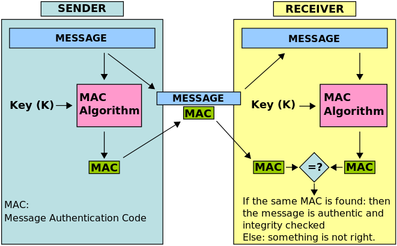
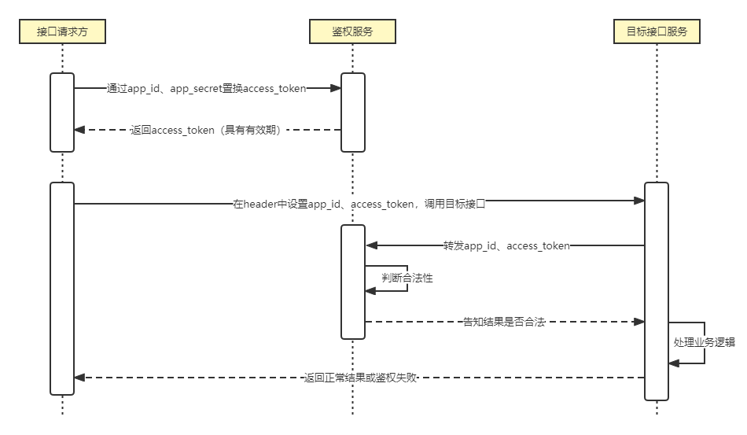
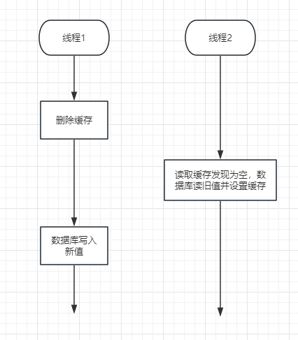
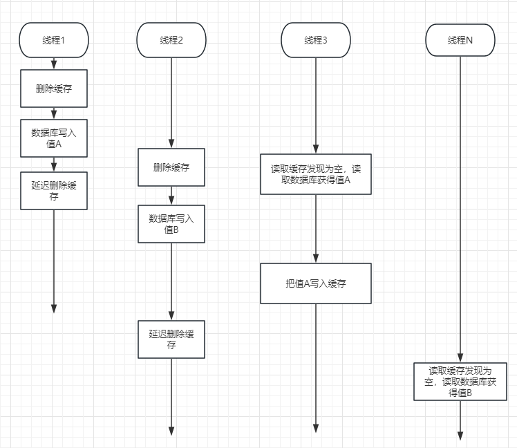

# 鉴权接口


## 认证


鉴权本质上是，用户（user / machine）如何获取权限，及如何鉴别身份去确定能够操作哪些资源。因此鉴权可以分为两部分内容：授权（Authorization）与认证（Authentication），我们先来看看该如何做认证。下面是某个平台的一个接口（非真实url），通过get请求获取信息：

```python
response = requests.get("http://xxxx/userinfo")
```


这个接口调用很简单也很方便，~~有一种奔放的美~~，但显而易见和安全两个字完全不沾边，可能我们部门有很多接口都是这么做的。带来的第一个问题是，我们没法监控到是谁调用了这个接口，无法进行身份的认证，很难做进一步的审计。那么一个简单的想法就是给自己的接口加一个参数，用来标明是谁调用的接口，类似这样：

```python
params = {"user": "xiaoshuai"} 
response = requests.get("http://xxxx/userinfo", params=params)
```


如此一来，就能知道是调用接口的是小帅，但倘若隔壁老王也假装自己是小帅，传同样的参数进行调用，又该如何应对呢。我们可以改进一下，不要这么直白的用user作为参数，而是创建user/password或者token私发给用户，避免老王伪装成小帅来进行调用，比如这样：

```python
params = { "username": "xiaoshuai", "password": "zhenshuai" } 
response = requests.get("http://xxxx/userinfo", params=params)
```


但get请求参数可能会被网关或其他地方的log直接记录下来，到时候某位同学一打开日志文件可能就发现了所有人的密码或token了。所以最好把这部分内容设置在header上或者干脆改成post请求放到body中。到这一步就很像HTTP Basic方法了，HTTP Basic是一种质询/响应的方法，可以参考一下它的逻辑：

1. client向server发起一个GET请求
2. server返回一个401告诉client要用Basic认证方式
3. client把username和password通过冒号连接，合并成一个字符串username:password
4. 进行base64编码
5. 放到header的Authorization字段中，然后向server发起请求
6. 服务端若没有认证通过，返回401；若认证通过，返回200

如：

```python
b64_str = base64.b64encode("username:password".encode()).decode() 
headers = {"Authorization": f"Basic {b64_str}"} 
response = requests.get("http://xxxx/userinfo", headers=headers)
```


但是base64毕竟只是一种编码，和明文传输相比不能说完全没有作用吧，只能说强的有限。在HTTP Basic中采用base64编码更多的是为了确保不出现特殊字符，**而不是为了提升多大的安全性**。因此如果要使用这种方法的话，**必须基于https**。既然base64只是编码协议不能保证密码安全，那我们换一种算法对密码进行哈希或者加密不就行了嘛，比如可以使用MD5对密码进行一下hash，然后仅向服务端发送username和经过md5以后的密码：

```python
headers = { 
  "X-Request-User": "username", 
  "X-Request-Password": hashlib.md5("password".encode()).hexdigest() 
} 
response = requests.get("http://xxxx/userinfo", headers=headers)
```


但此时依旧存在一些问题，是可以继续优化的。第一个问题是，md5的安全性不能算十分可靠，如果密码较简单，是可以用一些较大的彩虹表撞库撞出来的。第二个问题是，虽然避免了密码明文传输，但这种方式还是无法抵抗重放攻击，攻击者拿到md5后的密码一样可以进行接口调用。针对这些问题，可以从这些方面做优化：

1. MD5产生的是128位输出，SHA1产生160位，而SHA256产生的是256位，因此可以将MD5替换为SHA256来大幅度降低撞库风险
2. 将由用户生成的username/password改为由服务端生成的access_key/access_secret，提高secret的复杂度，避免弱密码
3. 增加nonce，这是一个随机数（或随机字符串），从而防止同个请求重复调用
4. 增加时间戳，当服务端收到请求后判断距离当前时间相差超过阈值（例如60秒），直接拒绝请求

```python
def gen_signature(message: str, nonce: str) -> str: 
  return hmac.new(nonce.encode(), message.encode(), hashlib.sha256).hexdigest() 

# nonce的生成可以是简单的randint(0, sys.maxsize)，也可以是uuid、objectId等 
headers = { 
  "X-Request-Key": "access_key", 
  "X-Request-Ts": timestamp, 
  "X-Request-Nonce": nonce, 
  "X-Request-Signature": gen_signature("&".join([access_secret, timestamp]), nonce) 
} 
response = requests.get("http://xxxx/userinfo", headers=headers)
```


在接收到请求以后，服务端首先对timestamp进行判断，如果超过设定的阈值则直接拒绝请求。如果时间戳判断通过，则判断nonce是否存在（可以通过缓存），若nonce已经存在，则拒绝请求。timestamp和nonce都检验通过后，服务端使用相同的哈希算法进行一次哈希，并将结果与客户端发送的结果进行比对，如果比对通过则接受请求。


那么现在是否已经足够安全了呢？还有一个风险点，就是如果存在中间人，他依旧可以抓包然后修改请求参数，从而获取到自己想要的信息。要解决这个问题，我们只需要在上面的签名生成函数中，按照规则把参数也加入到哈希中进行校验即可，这也是现在各大API开放平台普遍采用的AK/SK方法。这个具体规则可以由开发者来设立，每个API都可能不一样，有的较为复杂要进行多轮hash，有的较为简单只进行一轮hash。例如我们可以对参数的key进行升序排列后，加入到hash中，也可以把请求的path也加入hash中来：

```python
def gen_signature(secret: str, path: str, timestamp: str, nonce: str, params: dict) -> str: 
  hash_list = [timestamp, secret, path] 
  for key in sorted(params.keys()): 
    hash_list.append(f"{key}={params[key]}") 
  hash_str = "&".join(hash_list) 
  return hmac.new(nonce.encode(), hash_str.encode(), hashlib.sha256).hexdigest()
```


上述方法的原理就是HMAC（Hash-based message authentication 基于哈希的消息认证)，其核心思想MAC可以用维基百科的这张图来示意：



那么问题又来了，各大开放API平台，他们的接口全都是HTTPS，已经可以做到数据的加密和防篡改，那么为什么还是要将API认证设计成HMAC模式呢？这里可能有以下几点原因：

1. https若想防御中间人攻击，首先client端必须得有完备的证书验证，基本上现代浏览器如chrome、edge、safari等都会基于CA证书进行安全校验，如果发现证书等不匹配将会对用户进行告警和阻拦。但仍有部分浏览器没有做到应尽的责任，比如移动端的360浏览器，使用这类浏览器的用户不能保证https不被中间人劫持。另一方面，如果我们是写程序脚本进行接口调用，可能有的用户也会把证书校验选项给关掉（比如python的requests库的verify=False），一旦关闭以后就无法防范中间人伪造的证书，从而产生安全风险。
2. 在云架构、微服务盛行的现在，https能保证在外部不可信区域的安全，而经过网关进入内部网络后，有可能还是转化为http请求或其他形式调用指向实际的业务端。那么在内部网络里如果出现“内鬼”，他就可以在网关到业务端之间做手脚，获取到自己想要的信息。
3. 除了认证、防篡改的功能以外，HMAC请求还能保证通过校验的请求是合法的，即不是随便乱填参数请求的。如果验签不通过，那么业务端就认为这一次请求不合法，接下去的业务逻辑也没必要进行下去了。这样一来可以加强业务接口的稳定性，减少不合法请求对业务系统的压力。


HMAC就是最好的方式了吗？HMAC的签名方式毕竟还是比较复杂的，对于开发者和用户来说都不太友好，会增加理解成本和开发量。那么还有什么方式呢？我把目光投向了OAuth 2的其中一个flow，这个flow其实就非常契合我们的使用场景：


OAuth 2.0的Client Credentials Grant Flow一般用于https的server-to-server场景中，这种方式在部分API平台中也有运用，例如微信公众号开发者平台。基于这个流程我们设计一下权限2.0的API鉴权流程，如下所示：




在上述流程中，接口请求方（用户）需要提前来权限平台申请生成自己的app_id和app_secret，并进行对应接口（域）的授权申请。授权通过后，用app_id和app_secret向鉴权服务发起请求，交换得到access_token。这个access_token具有有效期（一般为1~2小时）。随后，用户向目标接口服务发起接口请求，并携带access_token信息，目标服务将该信息转发至鉴权服务，此时可以选择附带上path信息，判断用户是否具有某个具体接口的权限，也可以不携带仅进行用户身份认证（目标服务可自行进行path或scope的控制），在完成身份认证后进行业务逻辑处理，并最终返回数据。在这个流程中，token采用的是全局唯一随机字符串，而不是JWT等包含具体认证信息的字符串，主要是为了将权限控制全都放在鉴权服务后端，能够及时响应撤销授权。


## 授权


前面主要解释了一下认证相关流程，在整个鉴权流程中，授权也是十分关键的一部分。

生成专属于个人的app_id和app_secret，用户可以选择刷新secret，刷新后将会立即删除当前生效的access_token；管理员也可以选择撤回某个已生效的授权，撤回后也将立即更新信息阻止后续的访问。


## 使用缓存

 

既然我们的目标是能向其他工具平台提供鉴权服务，那么高并发是必须要考虑的点。以鉴权流程中的第一步获取access_token为例，其基本逻辑是：

1. 从数据库中找到app_id对应的app_secret
2. 将数据库中的值与接口传参的app_secret做校验
3. 若校验通过则生成token
4. 一些日志记录、数据库记录以及其他可能的操作，然后返回token

很明显，数据库操作容易成为并发瓶颈，我们可以引入缓存层来提高并发能力，例如redis。第一个可以被优化的就是数据库中的secret获取，我们把它改为从缓存中获取，一个最直接的思路就是先判断缓存中是否存在，若存在则直接返回，若不存在则从数据库中获取值、设置到缓存中然后返回：

```python
def get_secret_from_cache(app_id):
    key = f"some_prefix_{app_id}"
    cached_secret = redis.get(key)
    if cached_secret:
        return cached_secret
        
    secret = get_secret_from_db(app_id)
    if secret:
        redis.setex(key, expire, secret)
        
    return secret
```


通过上面的缓存操作，我们保证了某个app_id仅在第一次请求时进行数据库查询，随后的请求都会从缓存中查询，从而大幅度提高QPS。但当我们开发此类对外暴露的接口时，一定要牢记鲁迅先生的教导：”我向来不惮以最坏的恶意揣测接口调用者 :)“，我们设想以下几种情形：

1. 假若用户大量传入非法的，不存在的app_id，那么就会发生缓存穿透。在这种情况下我们发现，每一次调用都会请求数据库，而又因为数据库中实际上找不到对应的secret，导致缓存不会被设置上，缓存层形同虚设，数据库面临巨大的压力。
2. 假设某个app_id缓存的值已经过期删除了，此时有用户以非常高的并发请求该app_id，那么就会发生缓存击穿。在第一个请求还未能设置上缓存的时候，大量的请求已经开始访问数据库，数据库又面临了巨大的压力


对于第一种缓存穿透的情况，第一步肯定是先做好参数校验，尽量先提前排除掉一些不符合规则的参数情况。接下来，一种较为简单的做法是如果数据库中不存在对应值，我们也还是进行缓存的设置，只是设置成空值，那么后续的访问将直接从缓存层中获得空值并进行返回。但是调用者的恶意难道就止步于此了吗？倘若直接一个for循环生成大量不同的不存在的app_id，那么redis里面就会被插入大量无效的key，浪费我们的内存，是可忍孰不可忍？假如我们数据库中的数据量不可预估，那么此时可以考虑用布隆过滤器来帮助我们挡一波空值请求。但回看我们的应用场景，app_id信息的数量其实是在一个可控的范围内的，我们可以保守估计其数据基本也就是在几千，至多一两万的量级。因此我们可以起一个定时器把所有数据都刷到缓存里，一旦发现缓存里不存在该key，就可以认为是无效的app_id。通过这种做法，我们还顺便解决了第二个缓存击穿的问题。于是我们将代码的逻辑改成这样：

```python
def update_cache_schedule():
    # 从数据库中获取到access_list
    for access_info in access_list:
        # 从access_info中获取到key和value，假设expire为3600秒
        redis.setex(key, expire, value)
        
def get_secret_from_cache(app_id):
    key = f"some_prefix_{app_id}"
    cached_secret = redis.get(key)
    # 如果缓存中不存在key对应的值，直接返回None
    return cached_secret
```


但是这样做会带来数据一致性的问题，我们后文再谈。在用定时器刷新所有数据到缓存中的时候，要注意定时器执行间隔一定要小于缓存过期时间（视具体应用场景也可以考虑不设置过期时间），不然还是可能会发生缓存击穿或者缓存雪崩的问题。另一方面，在大批量设置过期时间的时候，建议可以适当加一些随机量，错开缓存过期的时间，降低redis卡顿的风险。除此之外还要注意一点，假如发生较为极端的情况导致redis内存占用满了，没有过期时间的key也可能被redis清理出去，那么对于较重要的这批缓存，我们可以缩短定时器执行间隔，或者另外起一个更频繁的定时器来检测缓存是否还有效。


再回头看上面的代码，还有可优化的地方吗？我们一直说，不要在for循环里面直接做数据库操作，会导致出现性能问题，这对redis其实也是一样的。当我们的数据量较小，比如几百、几千的时候，可能还感觉不出来影响，但当数据量扩大到几万、几十万甚至更大的时候，在for循环里进行redis.set操作将会十分耗时。这时候建议使用mset来操作，将代码改为：

```python
def update_cache_schedule():
    data_dict = {}
    for access_info in access_list:
        # 从access_info中获取到key和value
        data_dict[key] = value
    redis.mset(data_dict)
```


在我们的redis测试集群上测试一下耗时对比，得到如下数据：

|            | 插入1000条数据耗时 | 10000条耗时10000条耗时 | 100000条耗时100000条耗时 |
| ---------- | ------------------ | ---------------------- | ------------------------ |
| set放      | 0.63秒             | 7.11秒                 | 82.75秒                  |
| mset设定值 | 0.009秒            | 0.037秒                | 0.35秒                   |


可以看到随着数量级的提升，mset的性能对比set具有非常显著的优势。但是mset并不能像setex那样直接把过期时间也给设置上，我们需要在mset完以后额外调用expire操作，比如：

```python
def update_cache_schedule():
    # 假设已经设置好了data_dict
    redis.mset(data_dict)
    for key in data_dict.keys():
        redis.expire(key, 60)
```


啊？在for循环里一个个expire，那我们不是白用mset了，这不就又回去了吗？别急，此时我们可以利用redis的管道来进行优化，直接用setex来做：

```python
def update_cache_schedule():
    # 假设已经设置好了data_dict
    pipeline = redis.pipeline()
    for key, value in data_dict.items():
        pipeline.setex(key, 60, value)
    pipeline.execute()
```


同样进行耗时测试，可以得到使用pipeline相比for循环expire具有明显的性能优势：

|                            | 插入1000条数据耗时 | 10000条耗时10000条耗时 | 100000条耗时100000条耗时 |
| -------------------------- | ------------------ | ---------------------- | ------------------------ |
| mset（不进行expire）       | 0.009秒            | 0.037秒                | 0.35秒                   |
| mset + for循环expire       | 0.79秒             | 7.8秒                  | 73.17秒                  |
| pipeline进行mset然后expire | 0.021秒            | 0.106秒                | 1.06秒                   |
| pipeline进行setex          | 0.014秒            | 0.093秒                | 0.90秒                   |


在优化完定时器逻辑后，还有一个问题，我们希望当管理员通过一个授权申请，或者撤销一个授权以后，能尽快生效，而不是要等待定时器下一次刷新缓存才生效。也就是说，希望能尽可能保证数据一致性。按照上面的定时器刷新缓存的做法，不足以保证数据一致性，因此就需要在每次做数据库更新的时候，同时去“更新”缓存。这里的“更新”缓存一般而言有两种做法：

1. 真的做一次更新操作
2. 不做更新，而是做删除缓存的操作，当查询操作发现没有命中缓存的时候去设置缓存。这一步如果放到业务层面做，就是Cache Aside的设计模式，如果把它抽象出来单独做一个Provider，就是Read-Through模式


一般而言，主流的做法都是采用删除缓存而不是更新缓存，理由是大多数系统中，对一个key的更新概率可能大于它实际被使用到的概率。假设一个小时内我们可能会更新1000个key，但实际被使用到的key可能只有100个，因此如果频繁做更新缓存的操作，其实是对资源的浪费。另一方面，在高并发的情况下做更新而不是做删除操作，有更大可能性产生脏数据。而除了上述更新缓存的设计模式，其实还有其他的模式，例如结合消息队列来进行异步更新，或者是利用数据库log来回放操作更新缓存等等。但这些方法虽然在一些场景下有其优点，但也会提升系统复杂度，增加了出现异常的可能性。前文中采用的是定时器刷新数据进缓存，并且查询时不设置缓存的方式，如果这样的话那么就只能选择方案1，在数据被更新时去做一次更新缓存的操作。但是在综合考虑安全、成本、效率等因素后，我还是选择了定时器刷数据+查询为空设置缓存+数据库操作删除缓存的cache aside模式。


要注意的是，此时应当先进行数据库操作，然后再进行缓存的删除，如果反过来先删除缓存，再进行数据库操作的话，有更高的概率产生数据不一致问题。设想下面这种情况：



假如我们先删缓存再写入数据库，在写入数据库完成之前恰巧有另一个线程读取该缓存，就会发现缓存为空并读取数据库并把旧值更新到缓存中，这样就会导致直到该缓存下一次被删除之前，保存的都是旧值，产生数据不一致问题。而如果反过来，就是这种情况：


在这种情况下，最坏的情况是线程1从数据库写入新值到删除缓存的这个过程中，其他线程访问缓存会获取到旧值，但完成缓存删除后，后续的线程将得到新值，这一个时间段一般仅仅在几十毫秒到几百毫秒之间，是可以接受的，这种做法对我们目前的各个工具平台来说基本是足够了。但如果考虑更极端一点的情况，还是有可能会出现这样的情形：


在上面这种情况下，线程1完成了数据库写入并删除了缓存，线程2也开始写入数据库（但还未写入完成），与此同时线程3来读取数据发现缓存为空，去读取了数据库中的值A，并准备写入缓存。在线程3写入缓存之前，线程2完成了数据库的写入并删除了缓存，然后线程3把读出来的值A写入了缓存，于是数据不一致的情况又出现了。要解决这种情况，一个比较简单的做法是延迟双删，分为三步：1. 删除缓存；2. 写入数据库；3. 延时一段时间后再次删除缓存。那么上面这种情况就会变成：



延迟删除缓存最最重要的点在于对业务操作时间的预估，需要统计业务逻辑执行读数据库和写缓存的操作时间，在此基础上再增加几百毫秒到几秒左右的时间，来确保缓存被正确删除。打个比方，假如估算出来在这个业务流程中，读数据库+写入缓存最多耗时2秒，那就可以在此基础上再加1秒，也就是3秒作为延迟时间。如果为了进一步确保缓存被成功删除，在这里还可以结合消息队列，当发现删除失败的时候重试删除操作。


## 压测验证


前面说了这么多关于缓存的使用方法，核心目的就是为了提高接口性能。在面对类似的接口性能优化需求时，我们可以在优化完代码后先自己压测一波看看结果，这样调试起来效率会比较高。免费的压测工具目前用的比较多的有jmeter等，jmeter具有图形化界面，且支持插件扩展，也支持分布式压测。不过这里我推荐另外一款压测工具给我们组里的同学：locust，官网是：https://locust.io/。推荐locust的理由主要有以下几点：

1. jmeter并发基于java线程，而locust并发基于python或go的协程，在我们资源有限的台式机上可以获得更高的并发量
2. 对于熟悉python或go语言的同学来说，上手locust几乎没有学习成本
3. locust同样具有图形化数据展示、图表统计等，丰富程度虽然比不上jmeter，但也足够使用
4. 部署分布式发压端非常简单，仅需加一个命令行参数


安装locust非常简单，只需要有python3环境，然后执行**pip install locust**即可。接下来有两种选择，选择python作为发压端，或者选择go作为发压端，一般而言我们选择python作为发压端就已经能满足需求。如果选择python的话，就需要编写一个压测脚本，例如写一个test.py脚本：

```python
import json
from locust import task, FastHttpUser

class User(FastHttpUser):
    @task
    def task1(self):
        response = self.client.post(self.url, json=self.payloads)
    
    def on_start(self):
        with open("config.json", "r") as f:
            json_data = json.load(f)
            self.payloads = json_data["payloads"]
            self.url = json_data["url"]
```


这样就完成了一个压测脚本的编写，由于python存在GIL锁的限制，要利用全部机器性能，我们需要在同一台机器上跑多个worker。先来启动一下master进程：

```shell
locust -f test.py --master
```


然后启动多个worker进程，worker可以进行分布式部署，部署在任意一台linux或者windows机器上，只要告诉它master的地址就可以：

```shell
locust -f test.py --worker --master-host=xxx.xxx.xxx.xxx
```


master进程默认启动在8089端口，我们打开浏览器访问8089端口就可以看到locust的界面，输入并发数、压测目标host地址等就可以开始压测。在主频2.20Ghz，8核CPU的机器下，可以达到1000并发、27000+QPS的压力，或者5000并发、24000+QPS的压力。


这个发压端的能力对于我们大多数接口来说应当是能够满足需求了，但如果仍不满足，这时候我们可以将发压端切换为用go语言编写的boomer，首先需要在worker所在机器上安装golang，安装完毕之后找个目录安装boomer：

```go
go mod init your_project_name
go get github.com/myzhan/boomer@master
```


然后编写一个main.go脚本（不需要原来的test.py脚本了），例如：

```go
package main

import (
    "net"
    "net/http"
    "io"
    "io/ioutil"
    "log"
    "time"
    "github.com/myzhan/boomer"
 )


 var (
    Client *http.Client
 )

 func fun1() {
    start := time.Now()
    path := "/test"
    host := "http://your_service_address"
    url := host + path
    resp, err := Client.Get(url)

    if err != nil {
        log.Println(err)
        boomer.RecordFailure("Get", path, 0.0, err.Error())
        return
    } else {
        io.Copy(ioutil.Discard, resp.Body)
        boomer.RecordSuccess("Get", path, time.Now().Sub(start).Milliseconds(), resp.ContentLength)
        err = resp.Body.Close()
        if err != nil {
            return
        }
    }
 }
 
 func main() {
    tr := &http.Transport{
        DialContext: (&net.Dialer{
            Timeout:   10 * time.Second, //拨号等待连接完成的最大时间
            KeepAlive: 30 * time.Second, //保持网络连接活跃keep-alive探测间隔时间。
        }).DialContext,
        MaxIdleConns:        10000,    // 设置连接池最大10000个连接数
        IdleConnTimeout:     300 * time.Second,
        MaxIdleConnsPerHost: 10000,
    }

    Client = &http.Client{
        Transport: tr,
        Timeout:   30 * time.Second, //设置超时，包含connection时间、任意重定向时间、读取response body时间
    }

    task := &boomer.Task{
       Name:   "fun1",
       Weight: 10,
       Fn:     fun1,
    }
 
    boomer.Run(task)
 }
```


然后编译go脚本，在windows上得到main.exe，在linux得到main可执行文件。编译完成后运行可执行文件，由于go的协程可以直接利用多核CPU性能，所以同一台机器上只需要启动一个worker进程，指定一下master-host即可

```go
go build main.go
./main.exe --master-host=xxx.xxx.xxx.xxx
```

  

接下来同样是在master的网页端发起压测，可以看到boomer的发压能力是非常强大的，在上述同样的机器条件下可以做到2000并发、110000+QPS的发压能力。


可以说，这个发压能力对于我们来说是妥妥的足够了，如果还不满意，可以将上面用到的go自带的http库替换为fasthttp库，发压能力还能继续提升，如果有更多机器资源做分布式发压的话，可以达到百万级QPS压测能力。


## 结语


其实像HMAC、AK/SK、延迟双删等方法，大家可能都有了解或者已经在使用了。不过也许有的小伙伴还不太清楚“为什么要这么做”，所以这篇文章花了较多篇幅讲“为什么”，希望能抛砖引玉，给大家带来一点思考和讨论。